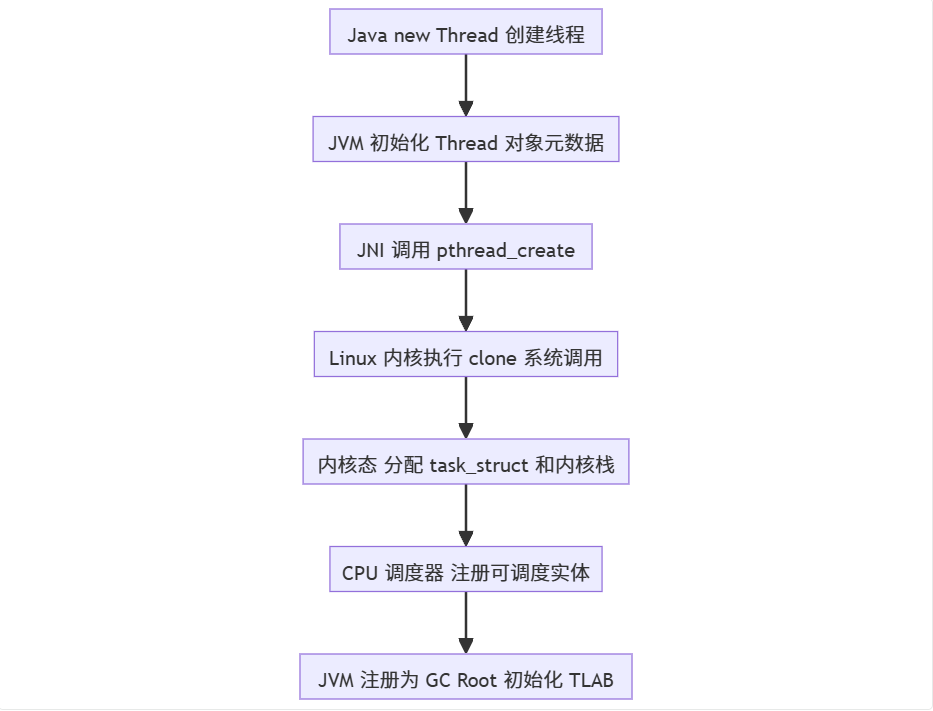
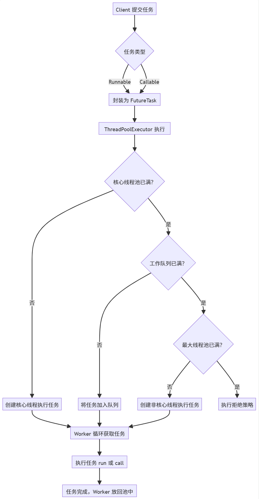

## <font style="color:rgb(0, 0, 0);">一、引言：高并发架构的 “线程依赖” 与认知误区</font>
<font style="color:rgb(0, 0, 0);">在互联网架构演进的历程中，性能优化的思路经历了从 “单机垂直增强” 到 “分布式水平扩展” 的跃迁 —— 早期通过升级 CPU 主频、扩容内存、优化 SQL 索引和缓存策略缓解瓶颈，而当业务规模突破单机极限（如秒杀场景每秒数十万请求、金融交易毫秒级响应要求），</font>**<font style="color:rgb(0, 0, 0) !important;">“如何高效调度任务、最大化利用硬件资源” 成为架构设计的核心命题</font>**<font style="color:rgb(0, 0, 0);">，线程与并发模型由此成为现代后端架构的 “基础设施”。</font>

<font style="color:rgb(0, 0, 0);">然而，Java 开发者对线程的认知普遍存在三层误区：</font>

1. **<font style="color:rgb(0, 0, 0) !important;">工具层误区</font>**<font style="color:rgb(0, 0, 0);">：认为 “能 new Thread ()、会调用 start ()” 就是懂线程，忽略了线程背后跨越用户态与内核态的复杂链路；</font>
2. **<font style="color:rgb(0, 0, 0) !important;">框架层误区</font>**<font style="color:rgb(0, 0, 0);">：将线程池视为 “性能优化工具”，仅关注 corePoolSize、maxPoolSize 等参数配置，未理解其作为 “系统稳定性屏障” 的架构价值；</font>
3. **<font style="color:rgb(0, 0, 0) !important;">演进层误区</font>**<font style="color:rgb(0, 0, 0);">：认为虚拟线程（Virtual Thread）会替代线程池，混淆了 “调度模型优化” 与 “资源治理策略” 的本质区别。</font>

<font style="color:rgb(0, 0, 0);">要打破这些误区，需先建立一条清晰的认知主线：</font>**<font style="color:rgb(0, 0, 0) !important;">线程是操作系统级的资源单位，线程池是资源治理的架构范式，虚拟线程是调度效率的技术革命</font>**<font style="color:rgb(0, 0, 0);">。三者并非替代关系，而是从 “资源管理” 到 “调度优化” 的递进演进。</font>

## <font style="color:rgb(0, 0, 0);">二、线程为何昂贵？从 OS 内核到 JVM 的全链路拆解</font>
<font style="color:rgb(0, 0, 0);">很多初学者误以为 “线程创建成本等同于 new Object ()”，根源在于 Java 的抽象封装掩盖了线程从 “语言对象” 到 “OS 调度实体” 的转化过程。实际上，一个 Java 线程的生命周期需跨越</font><font style="color:rgb(0, 0, 0);"> </font>**<font style="color:rgb(0, 0, 0) !important;">JVM 抽象层、JNI 调用层、OS 内核层</font>**<font style="color:rgb(0, 0, 0);"> </font><font style="color:rgb(0, 0, 0);">三层链路，其成本体现在内存、CPU、JVM 协同三个维度的 “重量级开销”。</font>

### <font style="color:rgb(0, 0, 0);">2.1 线程的本质：跨越用户态与内核态的调度实体</font>
<font style="color:rgb(0, 0, 0);">一个 Java 线程的创建链路并非 “new Thread ()” 这么简单，其完整流程如下：</font>



<font style="color:rgb(0, 0, 0);">其中，</font>**<font style="color:rgb(0, 0, 0) !important;">真正的 “重量级” 开销集中在pthread_create之后的步骤</font>**<font style="color:rgb(0, 0, 0);">—— 线程本质是 “Java 封装的 OS 调度实体”，而非单纯的语言级对象。这意味着：创建线程不仅是 JVM 堆中分配一个对象，更是向操作系统 “申请调度资源” 的过程。</font>

### <font style="color:rgb(0, 0, 0);">2.2 内存成本：线程的 “专属资源空间” 有多大？</font>
<font style="color:rgb(0, 0, 0);">每个线程需要占用多块独立内存区域，且部分区域的大小是 “固定开销”，无法通过 JVM 参数无限压缩。具体内存分布如下表所示：</font>

| **<font style="color:rgb(0, 0, 0) !important;">内存区域</font>** | **<font style="color:rgb(0, 0, 0) !important;">作用</font>** | **<font style="color:rgb(0, 0, 0) !important;">典型大小</font>** | **<font style="color:rgb(0, 0, 0) !important;">归属层级</font>** |
| :--- | :--- | :--- | :--- |
| <font style="color:rgba(0, 0, 0, 0.85) !important;">Java Thread 对象</font> | <font style="color:rgba(0, 0, 0, 0.85) !important;">存储线程元数据（ID、状态、优先级）</font> | <font style="color:rgba(0, 0, 0, 0.85) !important;">~512 字节</font> | <font style="color:rgba(0, 0, 0, 0.85) !important;">用户态（JVM）</font> |
| <font style="color:rgba(0, 0, 0, 0.85) !important;">Java 虚拟机栈（JVM Stack）</font> | <font style="color:rgba(0, 0, 0, 0.85) !important;">存储方法调用栈帧、局部变量、操作数栈</font> | <font style="color:rgba(0, 0, 0, 0.85) !important;">1MB（默认）</font> | <font style="color:rgba(0, 0, 0, 0.85) !important;">用户态（JVM）</font> |
| <font style="color:rgba(0, 0, 0, 0.85) !important;">TLAB（线程私有分配缓冲）</font> | <font style="color:rgba(0, 0, 0, 0.85) !important;">减少线程间对象分配竞争，加速内存分配</font> | <font style="color:rgba(0, 0, 0, 0.85) !important;">128KB~4MB</font> | <font style="color:rgba(0, 0, 0, 0.85) !important;">用户态（JVM）</font> |
| <font style="color:rgba(0, 0, 0, 0.85) !important;">Linux 内核栈</font> | <font style="color:rgba(0, 0, 0, 0.85) !important;">处理系统调用（如 IO、内存申请）的栈空间</font> | <font style="color:rgba(0, 0, 0, 0.85) !important;">8KB~32KB</font> | <font style="color:rgba(0, 0, 0, 0.85) !important;">内核态（OS）</font> |
| <font style="color:rgba(0, 0, 0, 0.85) !important;">task_struct（进程描述符）</font> | <font style="color:rgba(0, 0, 0, 0.85) !important;">存储 OS 调度所需信息（状态、优先级、PID）</font> | <font style="color:rgba(0, 0, 0, 0.85) !important;">~16KB（64 位系统）</font> | <font style="color:rgba(0, 0, 0, 0.85) !important;">内核态（OS）</font> |


**<font style="color:rgb(0, 0, 0) !important;">计算得出：一个线程的最小内存开销约 1.1MB</font>**<font style="color:rgb(0, 0, 0);">。若系统盲目创建 5000 个线程，仅 Java 虚拟机栈就需占用 5GB 内存（5000 * 1MB），直接触发 OOM 异常 —— 这也是 “Thread per request” 模型在高并发场景下必然崩溃的核心原因。</font>

### <font style="color:rgb(0, 0, 0);">2.3 CPU 成本：系统调用与上下文切换的 “隐性损耗”</font>
<font style="color:rgb(0, 0, 0);">线程创建的核心开销来自</font><font style="color:rgb(0, 0, 0);"> </font>**<font style="color:rgb(0, 0, 0) !important;">clone () 系统调用</font>**<font style="color:rgb(0, 0, 0);">，该过程会触发 CPU 从 “用户态” 切换到 “内核态”，并伴随一系列耗时操作：</font>

1. **<font style="color:rgb(0, 0, 0) !important;">CPU 模式切换</font>**<font style="color:rgb(0, 0, 0);">：用户态（Ring 3）权限低，内核态（Ring 0）权限高，切换时需更新 CPU 控制寄存器，耗时约 10~100 纳秒；</font>
2. **<font style="color:rgb(0, 0, 0) !important;">上下文保存与恢复</font>**<font style="color:rgb(0, 0, 0);">：需保存当前线程的寄存器值（如 PC 程序计数器、ESP 栈指针）到内核栈，恢复内核调度器的上下文，涉及内存读写操作；</font>
3. **<font style="color:rgb(0, 0, 0) !important;">TLB 刷新</font>**<font style="color:rgb(0, 0, 0);">：TLB（Translation Lookaside Buffer）是 CPU 缓存的地址映射表，切换线程后，旧的地址映射失效，需重新加载新线程的 TLB 条目，导致后续内存访问延迟增加（TLB Miss penalty 约 100~200 纳秒）；</font>
4. **<font style="color:rgb(0, 0, 0) !important;">CPU Pipeline Stall</font>**<font style="color:rgb(0, 0, 0);">：线程切换会中断当前 CPU 指令流水线（Pipeline），导致已加载的指令作废，重新填充流水线需 5~15 个时钟周期。</font>

<font style="color:rgb(0, 0, 0);">这些损耗看似微小，但 “频繁创建线程” 会放大问题 —— 例如，每秒创建 1000 个线程，仅上下文切换的耗时就可能占 CPU 总时间的 30% 以上，导致 “计算资源被调度本身消耗”，业务逻辑反而得不到执行。</font>

### <font style="color:rgb(0, 0, 0);">2.4 JVM 协同成本：线程安全与内存管理的 “额外负担”</font>
<font style="color:rgb(0, 0, 0);">JVM 为保证线程的安全性、可见性和可管理性，需为每个线程维护 “专属档案”，即使线程空闲也不会释放这些成本：</font>

+ **<font style="color:rgb(0, 0, 0) !important;">GC Root 注册</font>**<font style="color:rgb(0, 0, 0);">：线程对象会被标记为 GC Root，避免被垃圾回收器误回收；同时，线程的虚拟机栈中的局部变量也会作为 GC Root，需实时追踪栈帧变化；</font>
+ **<font style="color:rgb(0, 0, 0) !important;">Safepoint 接入</font>**<font style="color:rgb(0, 0, 0);">：线程需定期检查 Safepoint（安全点），以支持 GC 暂停、偏向锁撤销、JIT 编译等操作，这要求线程在执行过程中插入 “检查点” 指令；</font>
+ **<font style="color:rgb(0, 0, 0) !important;">ThreadLocalMap 初始化</font>**<font style="color:rgb(0, 0, 0);">：每个线程默认创建 ThreadLocalMap，用于存储线程私有数据，即使未使用 ThreadLocal，也会占用约 16 字节的初始空间；</font>
+ **<font style="color:rgb(0, 0, 0) !important;">TLB 管理</font>**<font style="color:rgb(0, 0, 0);">：JVM 需为每个线程分配独立的 TLAB，并定期调整 TLAB 大小（基于对象分配频率），避免线程间内存分配竞争。</font>

### <font style="color:rgb(0, 0, 0);">小结：线程昂贵的本质 ——“资源单位” 而非 “代码单位”</font>
<font style="color:rgb(0, 0, 0);">线程的成本并非来自 “创建对象”，而是来自 “成为 OS 调度实体” 所需的全链路资源投入。下表汇总了线程成本的核心来源：</font>

| **<font style="color:rgb(0, 0, 0) !important;">成本维度</font>** | **<font style="color:rgb(0, 0, 0) !important;">具体来源</font>** | **<font style="color:rgb(0, 0, 0) !important;">影响程度</font>** |
| :--- | :--- | :--- |
| <font style="color:rgba(0, 0, 0, 0.85) !important;">内存成本</font> | <font style="color:rgba(0, 0, 0, 0.85) !important;">多区域内存分配（虚拟机栈、内核栈、task_struct）</font> | <font style="color:rgba(0, 0, 0, 0.85) !important;">高</font> |
| <font style="color:rgba(0, 0, 0, 0.85) !important;">CPU 成本</font> | <font style="color:rgba(0, 0, 0, 0.85) !important;">系统调用、上下文切换、TLB 刷新、Pipeline Stall</font> | <font style="color:rgba(0, 0, 0, 0.85) !important;">中高</font> |
| <font style="color:rgba(0, 0, 0, 0.85) !important;">JVM 成本</font> | <font style="color:rgba(0, 0, 0, 0.85) !important;">GC Root 维护、Safepoint 检查、TLB 管理</font> | <font style="color:rgba(0, 0, 0, 0.85) !important;">中</font> |
| <font style="color:rgba(0, 0, 0, 0.85) !important;">应用成本</font> | <font style="color:rgba(0, 0, 0, 0.85) !important;">线程间同步（锁竞争）、栈深拷贝（线程销毁时）</font> | <font style="color:rgba(0, 0, 0, 0.85) !important;">中</font> |


<font style="color:rgb(0, 0, 0);">理解这一点，就能明白：</font>**<font style="color:rgb(0, 0, 0) !important;">线程池的核心价值不是 “优化性能”，而是 “治理资源”</font>**<font style="color:rgb(0, 0, 0);">—— 通过复用线程，摊销创建 / 销毁的重量级成本，同时通过 “资源上限控制” 避免系统被无限线程拖垮。</font>

## <font style="color:rgb(0, 0, 0);">三、线程池：从 “资源复用” 到 “架构韧性” 的设计演进</font>
<font style="color:rgb(0, 0, 0);">线程池的本质是 “</font>**<font style="color:rgb(0, 0, 0) !important;">线程生命周期管理 + 任务调度抽象 + 系统背压机制</font>**<font style="color:rgb(0, 0, 0);">” 的三位一体架构。它不仅解决了 “线程昂贵” 的技术问题，更构建了一套 “应对高并发的稳定性范式”，这也是为什么线程池成为所有后端架构的 “标配组件”。</font>

### <font style="color:rgb(0, 0, 0);">3.1 线程池的核心设计思想：从 “资源池化” 到 “韧性保障”</font>
<font style="color:rgb(0, 0, 0);">线程池的设计并非凭空出现，而是 “池化思想” 在并发领域的延伸（类似数据库连接池、对象池）。其核心设计意图与架构效果的对应关系如下：</font>

| **<font style="color:rgb(0, 0, 0) !important;">设计意图</font>** | **<font style="color:rgb(0, 0, 0) !important;">底层技术手段</font>** | **<font style="color:rgb(0, 0, 0) !important;">架构效果</font>** |
| :--- | :--- | :--- |
| <font style="color:rgba(0, 0, 0, 0.85) !important;">资源复用</font> | <font style="color:rgba(0, 0, 0, 0.85) !important;">线程创建后不销毁，放回池中等待复用</font> | <font style="color:rgba(0, 0, 0, 0.85) !important;">摊销线程创建 / 销毁成本，降低 CPU / 内存损耗</font> |
| <font style="color:rgba(0, 0, 0, 0.85) !important;">调度抽象</font> | <font style="color:rgba(0, 0, 0, 0.85) !important;">解耦 “任务提交”（Client）与 “任务执行”（Worker）</font> | <font style="color:rgba(0, 0, 0, 0.85) !important;">支持灵活切换执行模型（如 OS 线程→虚拟线程）</font> |
| <font style="color:rgba(0, 0, 0, 0.85) !important;">任务缓冲</font> | <font style="color:rgba(0, 0, 0, 0.85) !important;">引入工作队列（Work Queue）</font> | <font style="color:rgba(0, 0, 0, 0.85) !important;">削峰填谷，避免瞬间流量冲垮执行线程</font> |
| <font style="color:rgba(0, 0, 0, 0.85) !important;">背压机制</font> | <font style="color:rgba(0, 0, 0, 0.85) !important;">拒绝策略（Reject Policy）+ 资源上限控制</font> | <font style="color:rgba(0, 0, 0, 0.85) !important;">防止系统过载，保障核心业务可用性</font> |
| <font style="color:rgba(0, 0, 0, 0.85) !important;">弹性伸缩</font> | <font style="color:rgba(0, 0, 0, 0.85) !important;">核心线程（core）+ 非核心线程（max）</font> | <font style="color:rgba(0, 0, 0, 0.85) !important;">高峰期扩容提升吞吐量，低峰期缩容节约资源</font> |


<font style="color:rgb(0, 0, 0);">以电商秒杀场景为例：秒杀开始时请求量骤增，线程池通过 “队列缓冲” 暂存超出核心线程处理能力的任务，同时启动非核心线程加速执行；若请求量超过队列 + 最大线程的承载能力，拒绝策略会丢弃非核心请求（如 “已售罄” 提示），确保核心下单流程不崩溃 —— 这就是线程池作为 “架构韧性屏障” 的价值。</font>

### <font style="color:rgb(0, 0, 0);">3.2 ThreadPoolExecutor 核心组件与源码解析</font>
<font style="color:rgb(0, 0, 0);">Java 中的 ThreadPoolExecutor 是线程池设计的经典实现，其核心组件与执行链路可通过以下流程图理解：</font>



#### <font style="color:rgb(0, 0, 0);">关键组件的底层逻辑</font>
1. **<font style="color:rgb(0, 0, 0) !important;">Worker 线程</font>**<font style="color:rgb(0, 0, 0);">：本质是 “线程 + 任务” 的封装，实现了 Runnable 接口，其 run () 方法会调用 </font><font style="color:rgba(0, 0, 0, 0.85) !important;">getTask()</font><font style="color:rgb(0, 0, 0);"> 循环从队列获取任务。核心源码片段（JDK 17）：</font>**<font style="color:rgba(0, 0, 0, 0.85);"></font>**

```java
private Runnable getTask() {
    boolean timedOut = false; // 标记是否超时
    for (;;) {
        int c = ctl.get();
        int rs = runStateOf(c);

        // 若线程池已关闭，或队列空且线程池处于关闭中，返回null（销毁线程）
        if (rs >= SHUTDOWN && (rs >= STOP || workQueue.isEmpty())) {
            decrementWorkerCount();
            return null;
        }

        int wc = workerCountOf(c);
        // 判断是否需要超时回收（非核心线程，或允许核心线程超时）
        boolean timed = allowCoreThreadTimeOut || wc > corePoolSize;

        // 若线程数超过最大线程数，或超时且队列空，销毁当前线程
        if ((wc > maximumPoolSize || (timed && timedOut))
            && (wc > 1 || workQueue.isEmpty())) {
            if (compareAndDecrementWorkerCount(c))
                return null;
            continue;
        }

        try {
            // 超时获取任务：非核心线程会阻塞 keepAliveTime 后返回 null
            Runnable r = timed ?
                workQueue.poll(keepAliveTime, TimeUnit.NANOSECONDS) :
                workQueue.take(); // 核心线程无限阻塞等待任务
            if (r != null)
                return r;
            timedOut = true; // 标记超时
        } catch (InterruptedException retry) {
            timedOut = false;
        }
    }
}
```

<font style="color:rgb(0, 0, 0);">这段代码揭示了线程池的 “弹性回收逻辑”：非核心线程会通过</font><font style="color:rgb(0, 0, 0);"> </font><font style="color:rgba(0, 0, 0, 0.85) !important;">poll(keepAliveTime)</font><font style="color:rgb(0, 0, 0);"> </font><font style="color:rgb(0, 0, 0);">超时等待任务，超时后返回 null，触发 Worker 线程销毁；而核心线程默认通过</font><font style="color:rgb(0, 0, 0);"> </font><font style="color:rgba(0, 0, 0, 0.85) !important;">take()</font><font style="color:rgb(0, 0, 0);"> </font><font style="color:rgb(0, 0, 0);">无限阻塞，除非开启</font><font style="color:rgb(0, 0, 0);"> </font><font style="color:rgba(0, 0, 0, 0.85) !important;">allowCoreThreadTimeOut=true</font><font style="color:rgb(0, 0, 0);">。</font>

2. **<font style="color:rgb(0, 0, 0) !important;">工作队列（Work Queue）</font>**<font style="color:rgb(0, 0, 0);">：是线程池的 “缓冲中枢”，不同队列类型决定了线程池的承载能力与风险：</font>
    - **<font style="color:rgb(0, 0, 0) !important;">ArrayBlockingQueue</font>**<font style="color:rgb(0, 0, 0);">：有界数组队列，需指定容量，适合 “稳定可控” 的场景（如核心业务线程池）；</font>
    - **<font style="color:rgb(0, 0, 0) !important;">LinkedBlockingQueue</font>**<font style="color:rgb(0, 0, 0);">：链表队列，默认无界（Integer.MAX_VALUE），高并发下易导致任务堆积→OOM，大厂普遍禁用；</font>
    - **<font style="color:rgb(0, 0, 0) !important;">SynchronousQueue</font>**<font style="color:rgb(0, 0, 0);">：无容量队列，任务需直接交给线程执行，适合 “短任务、高吞吐” 场景（如 RPC 调用线程池）；</font>
    - **<font style="color:rgb(0, 0, 0) !important;">PriorityBlockingQueue</font>**<font style="color:rgb(0, 0, 0);">：优先级队列，支持按任务优先级执行，适合 “任务有先后顺序” 的场景（如定时任务调度）。</font>
3. **<font style="color:rgb(0, 0, 0) !important;">拒绝策略（Reject Policy）</font>**<font style="color:rgb(0, 0, 0);">：是线程池的 “最后一道防线”，决定了系统过载时如何处理新任务：</font>

| **<font style="color:rgb(0, 0, 0) !important;">拒绝策略</font>** | **<font style="color:rgb(0, 0, 0) !important;">核心逻辑</font>** | **<font style="color:rgb(0, 0, 0) !important;">适用场景</font>** |
| :--- | :--- | :--- |
| <font style="color:rgba(0, 0, 0, 0.85) !important;">AbortPolicy（默认）</font> | <font style="color:rgba(0, 0, 0, 0.85) !important;">抛出 RejectedExecutionException</font> | <font style="color:rgba(0, 0, 0, 0.85) !important;">核心业务，需快速失败并报警</font> |
| <font style="color:rgba(0, 0, 0, 0.85) !important;">CallerRunsPolicy</font> | <font style="color:rgba(0, 0, 0, 0.85) !important;">由提交任务的线程（如 Tomcat 线程）执行</font> | <font style="color:rgba(0, 0, 0, 0.85) !important;">非核心业务，需背压上游避免系统崩溃</font> |
| <font style="color:rgba(0, 0, 0, 0.85) !important;">DiscardOldestPolicy</font> | <font style="color:rgba(0, 0, 0, 0.85) !important;">丢弃队列中最旧的任务，执行新任务</font> | <font style="color:rgba(0, 0, 0, 0.85) !important;">实时性任务（如日志收集），旧任务无价值</font> |
| <font style="color:rgba(0, 0, 0, 0.85) !important;">DiscardPolicy</font> | <font style="color:rgba(0, 0, 0, 0.85) !important;">直接丢弃新任务，不抛异常</font> | <font style="color:rgba(0, 0, 0, 0.85) !important;">非关键任务（如监控上报），允许少量丢失</font> |


### <font style="color:rgb(0, 0, 0);">3.3 线程池的架构价值：为何 “task.run ()” 比 “new Thread ().start ()” 快？</font>
<font style="color:rgb(0, 0, 0);">当线程池中的 Worker 线程执行</font><font style="color:rgb(0, 0, 0);"> </font><font style="color:rgba(0, 0, 0, 0.85) !important;">task.run()</font><font style="color:rgb(0, 0, 0);"> </font><font style="color:rgb(0, 0, 0);">时，其成本仅是 “方法调用开销”，而非 “线程创建开销”—— 原因在于：</font>

+ **<font style="color:rgb(0, 0, 0) !important;">资源已预分配</font>**<font style="color:rgb(0, 0, 0);">：Worker 线程的虚拟机栈、内核栈、TLAB 等资源已在创建时分配，无需重新申请；</font>
+ **<font style="color:rgb(0, 0, 0) !important;">上下文已就绪</font>**<font style="color:rgb(0, 0, 0);">：线程已注册到 OS 调度器，执行任务时无需触发系统调用和上下文切换；</font>
+ **<font style="color:rgb(0, 0, 0) !important;">JVM 协同成本已摊销</font>**<font style="color:rgb(0, 0, 0);">：GC Root、Safepoint 等管理成本在 Worker 线程创建时已支付，后续复用无需重复处理。</font>

<font style="color:rgb(0, 0, 0);">本质上，线程池将 “线程创建的一次性高成本”，转化为 “任务执行的多次低成本”，这是其提升并发效率的核心逻辑。</font>

## <font style="color:rgb(0, 0, 0);">四、线程池参数调优：从 “理论公式” 到 “工程实践”</font>
<font style="color:rgb(0, 0, 0);">线程池参数配置是 “写代码” 与 “做架构” 的分水岭 —— 理论公式仅能提供基线，实际配置需结合业务场景、硬件资源、监控数据进行 “闭环调优”。</font>

### <font style="color:rgb(0, 0, 0);">4.1 核心参数的理论基线：CPU 密集 vs IO 密集</font>
<font style="color:rgb(0, 0, 0);">线程池的核心参数（corePoolSize、maxPoolSize）需根据任务的 “计算 / IO 占比” 确定，因为这直接影响线程的 “空闲率”：</font>

| **<font style="color:rgb(0, 0, 0) !important;">任务类型</font>** | **<font style="color:rgb(0, 0, 0) !important;">核心特征</font>** | **<font style="color:rgb(0, 0, 0) !important;">理论线程数公式</font>** | **<font style="color:rgb(0, 0, 0) !important;">示例（8 核 CPU）</font>** |
| :--- | :--- | :--- | :--- |
| <font style="color:rgba(0, 0, 0, 0.85) !important;">CPU 密集型</font> | <font style="color:rgba(0, 0, 0, 0.85) !important;">线程几乎不阻塞（如数学计算、序列化）</font> | <font style="color:rgba(0, 0, 0, 0.85) !important;">CPU 核心数 + 1（避免 CPU 空闲）</font> | <font style="color:rgba(0, 0, 0, 0.85) !important;">8 + 1 = 9</font> |
| <font style="color:rgba(0, 0, 0, 0.85) !important;">IO 密集型</font> | <font style="color:rgba(0, 0, 0, 0.85) !important;">线程频繁阻塞（如 DB 读写、HTTP 调用）</font> | <font style="color:rgba(0, 0, 0, 0.85) !important;">CPU 核心数 × (1 + 等待时间 / 计算时间)</font> | <font style="color:rgba(0, 0, 0, 0.85) !important;">8 × 2~4 = 16~32</font> |
| <font style="color:rgba(0, 0, 0, 0.85) !important;">混合型</font> | <font style="color:rgba(0, 0, 0, 0.85) !important;">计算与 IO 占比相当</font> | <font style="color:rgba(0, 0, 0, 0.85) !important;">拆分两个线程池：CPU 密集池 + IO 密集池</font> | <font style="color:rgba(0, 0, 0, 0.85) !important;">9（计算）+ 16（IO）</font> |


**<font style="color:rgb(0, 0, 0) !important;">注意</font>**<font style="color:rgb(0, 0, 0);">：理论公式仅为起点，实际调优需通过压测验证 —— 例如，某 IO 密集型任务的 “等待时间 / 计算时间” 为 3，理论线程数为 8×4=32，但压测发现 24 线程时 CPU 利用率已达 90%（上下文切换增加），最终确定 20 为最优值。</font>

### <font style="color:rgb(0, 0, 0);">4.2 工程化调优方法论：基于监控的闭环</font>
<font style="color:rgb(0, 0, 0);">线程池调优不是 “拍脑袋定参数”，而是 “监控→分析→调整→验证” 的循环过程。以下是一套生产环境落地的调优流程：</font>

1. **<font style="color:rgb(0, 0, 0) !important;">设定基线参数</font>**<font style="color:rgb(0, 0, 0);">：根据任务类型确定初始参数（如 IO 密集型任务初始 core=16，max=32，队列 = 200）；</font>
2. **<font style="color:rgb(0, 0, 0) !important;">压测模拟流量</font>**<font style="color:rgb(0, 0, 0);">：使用 JMeter、Gatling 等工具模拟高并发场景（如每秒 1 万请求）；</font>
3. **<font style="color:rgb(0, 0, 0) !important;">监控关键指标</font>**<font style="color:rgb(0, 0, 0);">：通过 Micrometer + Prometheus + Grafana 监控以下指标：</font>

| **<font style="color:rgb(0, 0, 0) !important;">指标名称</font>** | **<font style="color:rgb(0, 0, 0) !important;">核心含义</font>** | **<font style="color:rgb(0, 0, 0) !important;">预警阈值参考</font>** |
| :--- | :--- | :--- |
| <font style="color:rgba(0, 0, 0, 0.85) !important;">executor_active_threads</font> | <font style="color:rgba(0, 0, 0, 0.85) !important;">当前活跃线程数</font> | <font style="color:rgba(0, 0, 0, 0.85) !important;">超过 maxPoolSize 的 80% 需关注</font> |
| <font style="color:rgba(0, 0, 0, 0.85) !important;">executor_queue_size</font> | <font style="color:rgba(0, 0, 0, 0.85) !important;">队列中等待的任务数</font> | <font style="color:rgba(0, 0, 0, 0.85) !important;">超过队列容量的 50% 需扩容</font> |
| <font style="color:rgba(0, 0, 0, 0.85) !important;">executor_reject_count</font> | <font style="color:rgba(0, 0, 0, 0.85) !important;">任务被拒绝的次数</font> | <font style="color:rgba(0, 0, 0, 0.85) !important;">大于 0 需告警，分析是否参数不足</font> |
| <font style="color:rgba(0, 0, 0, 0.85) !important;">executor_task_duration</font> | <font style="color:rgba(0, 0, 0, 0.85) !important;">任务平均执行时间</font> | <font style="color:rgba(0, 0, 0, 0.85) !important;">超过预期值（如 100ms）需优化任务逻辑</font> |
| <font style="color:rgba(0, 0, 0, 0.85) !important;">executor_thread_idle_ratio</font> | <font style="color:rgba(0, 0, 0, 0.85) !important;">线程空闲比例</font> | <font style="color:rgba(0, 0, 0, 0.85) !important;">低于 20% 需扩容，高于 80% 需缩容</font> |


4. **<font style="color:rgb(0, 0, 0) !important;">调整参数验证</font>**<font style="color:rgb(0, 0, 0);">：若出现队列堆积，可增加 maxPoolSize 或队列容量；若出现 CPU 飙升，可减少线程数；</font>
5. **<font style="color:rgb(0, 0, 0) !important;">固化最优参数</font>**<font style="color:rgb(0, 0, 0);">：将验证通过的参数写入配置文件（如 Apollo 配置中心），支持动态调整。</font>

### <font style="color:rgb(0, 0, 0);">4.3 线程池隔离：避免 “一损俱损” 的雪崩效应</font>
<font style="color:rgb(0, 0, 0);">单一线程池处理所有任务是典型的 “反模式”—— 若某类任务阻塞（如 DB 慢查询），会导致线程池耗尽，进而影响所有业务。解决思路是 “</font>**<font style="color:rgb(0, 0, 0) !important;">线程池隔离</font>**<font style="color:rgb(0, 0, 0);">”，即按业务类型拆分线程池，实现 “舱壁模式（Bulkhead Pattern）”。</font>

<font style="color:rgb(0, 0, 0);">以下是电商系统的线程池隔离方案示例：</font>

| **<font style="color:rgb(0, 0, 0) !important;">线程池类型</font>** | **<font style="color:rgb(0, 0, 0) !important;">核心参数（8 核 CPU）</font>** | **<font style="color:rgb(0, 0, 0) !important;">队列类型</font>** | **<font style="color:rgb(0, 0, 0) !important;">拒绝策略</font>** | **<font style="color:rgb(0, 0, 0) !important;">业务场景</font>** |
| :--- | :--- | :--- | :--- | :--- |
| <font style="color:rgba(0, 0, 0, 0.85) !important;">订单核心线程池</font> | <font style="color:rgba(0, 0, 0, 0.85) !important;">core=16，max=32</font> | <font style="color:rgba(0, 0, 0, 0.85) !important;">ArrayBlockingQueue(200)</font> | <font style="color:rgba(0, 0, 0, 0.85) !important;">AbortPolicy</font> | <font style="color:rgba(0, 0, 0, 0.85) !important;">下单、支付、库存扣减</font> |
| <font style="color:rgba(0, 0, 0, 0.85) !important;">商品查询线程池</font> | <font style="color:rgba(0, 0, 0, 0.85) !important;">core=8，max=16</font> | <font style="color:rgba(0, 0, 0, 0.85) !important;">ArrayBlockingQueue(100)</font> | <font style="color:rgba(0, 0, 0, 0.85) !important;">CallerRunsPolicy</font> | <font style="color:rgba(0, 0, 0, 0.85) !important;">商品列表、详情查询</font> |
| <font style="color:rgba(0, 0, 0, 0.85) !important;">日志上报线程池</font> | <font style="color:rgba(0, 0, 0, 0.85) !important;">core=4，max=8</font> | <font style="color:rgba(0, 0, 0, 0.85) !important;">ArrayBlockingQueue(50)</font> | <font style="color:rgba(0, 0, 0, 0.85) !important;">DiscardPolicy</font> | <font style="color:rgba(0, 0, 0, 0.85) !important;">操作日志、错误日志上报</font> |
| <font style="color:rgba(0, 0, 0, 0.85) !important;">定时任务线程池</font> | <font style="color:rgba(0, 0, 0, 0.85) !important;">core=2，max=4</font> | <font style="color:rgba(0, 0, 0, 0.85) !important;">PriorityBlockingQueue(20)</font> | <font style="color:rgba(0, 0, 0, 0.85) !important;">AbortPolicy</font> | <font style="color:rgba(0, 0, 0, 0.85) !important;">订单超时关闭、库存同步</font> |


<font style="color:rgb(0, 0, 0);">通过隔离，即使 “商品查询线程池” 因 DB 慢查询阻塞，也不会影响 “订单核心线程池” 的正常执行，避免了全系统雪崩（注：关键的线程池参数的设定需要根据性能目标做压测，此处仅为示例设置）。</font>

## <font style="color:rgb(0, 0, 0);">五、工程实践：线程池的监控、最佳实践与避坑指南</font>
<font style="color:rgb(0, 0, 0);">线程池的 “纸上谈兵” 容易，生产环境落地需关注 “监控可视化”“风险规避”“优雅运维” 三个维度。</font>

### <font style="color:rgb(0, 0, 0);">5.1 线程池监控：Spring Boot + Micrometer + Prometheus 落地</font>
<font style="color:rgb(0, 0, 0);">以下是一套生产可用的线程池监控方案，支持实时查看线程池状态、告警异常指标：</font>

#### <font style="color:rgb(0, 0, 0);">1. 依赖引入（Maven）</font>
```xml
<dependency>
    <groupId>org.springframework.boot</groupId>
    <artifactId>spring-boot-starter-actuator</artifactId>
</dependency>
<dependency>
    <groupId>io.micrometer</groupId>
    <artifactId>micrometer-registry-prometheus</artifactId>
</dependency>
```

#### <font style="color:rgb(0, 0, 0);">2. 线程池配置与监控绑定</font>
```java
import io.micrometer.core.instrument.MeterRegistry;
import io.micrometer.core.instrument.binder.jvm.ExecutorServiceMetrics;
import org.springframework.context.annotation.Bean;
import org.springframework.context.annotation.Configuration;
import java.util.concurrent.ArrayBlockingQueue;
import java.util.concurrent.ThreadPoolExecutor;
import java.util.concurrent.TimeUnit;
import java.util.concurrent.Executors;

@Configuration
public class ThreadPoolConfig {

    // 核心业务线程池
    @Bean(name = "orderExecutor")
    public ThreadPoolExecutor orderExecutor(MeterRegistry meterRegistry) {
        ThreadPoolExecutor executor = new ThreadPoolExecutor(
                16, // corePoolSize
                32, // maxPoolSize
                60, // keepAliveTime
                TimeUnit.SECONDS,
                new ArrayBlockingQueue<>(200), // 有界队列
                Executors.defaultThreadFactory(), // 线程工厂（建议自定义命名）
                new ThreadPoolExecutor.AbortPolicy() // 拒绝策略
        );

        // 绑定 Micrometer 监控，添加业务标签便于区分
        ExecutorServiceMetrics.monitor(
                meterRegistry,
                executor,
                "threadPool.orderExecutor", // 指标前缀
                "module", "order", // 业务模块标签
                "env", "prod" // 环境标签
        );

        return executor;
    }

    // 自定义线程工厂（推荐）：线程名包含业务信息，便于日志排查
    @Bean
    public ThreadFactory orderThreadFactory() {
        return new ThreadFactory() {
            private final AtomicInteger sequence = new AtomicInteger(0);
            @Override
            public Thread newThread(Runnable r) {
                Thread thread = new Thread(r);
                thread.setName("order-executor-" + sequence.getAndIncrement());
                thread.setDaemon(false); // 非守护线程，避免 JVM 退出时任务中断
                return thread;
            }
        };
    }
}
```

#### <font style="color:rgb(0, 0, 0);">3. 暴露监控指标</font>
<font style="color:rgb(0, 0, 0);">在 </font><font style="color:rgba(0, 0, 0, 0.85) !important;">application.yml</font><font style="color:rgb(0, 0, 0);"> 中配置 Actuator 暴露 Prometheus 指标：</font>

```yaml
management:
  endpoints:
    web:
      exposure:
        include: prometheus,health,info
  metrics:
    tags:
      application: order-service # 应用标签，便于多服务监控
```

#### <font style="color:rgb(0, 0, 0);">4. Grafana 可视化</font>
<font style="color:rgb(0, 0, 0);">在 Grafana 中导入 “线程池监控仪表盘”（可使用社区模板 ID：1872），配置 Prometheus 数据源后，即可查看以下核心指标：</font>

+ <font style="color:rgb(0, 0, 0);">活跃线程数（executor_active_threads）</font>
+ <font style="color:rgb(0, 0, 0);">队列任务数（executor_queue_size）</font>
+ <font style="color:rgb(0, 0, 0);">任务完成总数（executor_completed_tasks_total）</font>
+ <font style="color:rgb(0, 0, 0);">拒绝任务数（executor_rejected_tasks_total）</font>
+ <font style="color:rgb(0, 0, 0);">线程池大小（executor_pool_size）</font>

### <font style="color:rgb(0, 0, 0);">5.2 线程池最佳实践与避坑指南</font>
1. **<font style="color:rgb(0, 0, 0) !important;">禁用 Executors 工具类创建线程池</font>**<font style="color:rgb(0, 0, 0);">：</font>
    - <font style="color:rgb(0, 0, 0);">Executors.newFixedThreadPool()</font><font style="color:rgb(0, 0, 0);">：使用 LinkedBlockingQueue（无界），易 OOM；</font>
    - <font style="color:rgb(0, 0, 0);">Executors.newCachedThreadPool()</font><font style="color:rgb(0, 0, 0);">：maxPoolSize 为 Integer.MAX_VALUE，易创建大量线程导致 CPU 飙升；</font>
    - <font style="color:rgb(0, 0, 0);">推荐直接使用</font><font style="color:rgb(0, 0, 0);"> </font><font style="color:rgb(0, 0, 0);">ThreadPoolExecutor</font><font style="color:rgb(0, 0, 0);"> </font><font style="color:rgb(0, 0, 0);">构造函数，显式指定队列和拒绝策略。</font>
2. **<font style="color:rgb(0, 0, 0) !important;">线程命名规范</font>**<font style="color:rgb(0, 0, 0);">：线程名需包含 “业务模块 + 线程池类型”（如</font><font style="color:rgb(0, 0, 0);"> </font><font style="color:rgba(0, 0, 0, 0.85) !important;">order-executor-0</font><font style="color:rgb(0, 0, 0);">），便于通过日志（如 ELK）定位线程相关问题（如线程泄漏、死锁）。</font>
3. **<font style="color:rgb(0, 0, 0) !important;">避免线程池共享</font>**<font style="color:rgb(0, 0, 0);">：不同业务的任务需使用独立线程池，避免 “一个业务阻塞导致全线程池耗尽”（参考 4.3 节的隔离方案）。</font>
4. **<font style="color:rgb(0, 0, 0) !important;">优雅关闭线程池</font>**<font style="color:rgb(0, 0, 0);">：</font>
    - <font style="color:rgb(0, 0, 0);">关闭时需调用</font><font style="color:rgb(0, 0, 0);"> </font><font style="color:rgb(0, 0, 0);">shutdown()</font><font style="color:rgb(0, 0, 0);">（而非</font><font style="color:rgb(0, 0, 0);"> </font><font style="color:rgb(0, 0, 0);">shutdownNow()</font><font style="color:rgb(0, 0, 0);">），允许队列中已有的任务执行完成；</font>
    - <font style="color:rgb(0, 0, 0);">若需强制关闭，需处理</font><font style="color:rgb(0, 0, 0);"> </font><font style="color:rgb(0, 0, 0);">shutdownNow()</font><font style="color:rgb(0, 0, 0);"> </font><font style="color:rgb(0, 0, 0);">返回的未执行任务，避免任务丢失；</font>
    - <font style="color:rgb(0, 0, 0);">示例代码:</font>

```java
@PreDestroy // Spring 容器销毁时执行
public void shutdownExecutor() {
    ThreadPoolExecutor executor = (ThreadPoolExecutor) applicationContext.getBean("orderExecutor");
    executor.shutdown();
    try {
        // 等待 60 秒，若任务仍未完成则强制关闭
        if (!executor.awaitTermination(60, TimeUnit.SECONDS)) {
            List<Runnable> unfinishedTasks = executor.shutdownNow();
            log.warn("线程池关闭超时，未完成任务数：{}", unfinishedTasks.size());
        }
    } catch (InterruptedException e) {
        executor.shutdownNow();
    }
}
```

5. **<font style="color:rgb(0, 0, 0) !important;">警惕线程泄漏</font>**<font style="color:rgb(0, 0, 0);">：</font>
    - <font style="color:rgb(0, 0, 0);">若任务中存在无限循环、死锁，会导致 Worker 线程一直占用，无法回收；</font>
    - <font style="color:rgb(0, 0, 0);">需通过监控 “活跃线程数长期不变”“任务执行时间过长” 等指标，及时发现线程泄漏。</font>

## <font style="color:rgb(0, 0, 0);">六、虚拟线程：调度模型的革命，而非线程池的替代</font>
<font style="color:rgb(0, 0, 0);">JDK 21 正式 GA 的虚拟线程（Virtual Thread），是 Java 并发模型的重大升级 —— 但它并非 “线程池的替代品”，而是 “调度效率的优化者”，二者需结合使用才能发挥最大价值。</font>

### <font style="color:rgb(0, 0, 0);">6.1 虚拟线程的核心原理：用户态调度的 “轻量级线程”</font>
<font style="color:rgb(0, 0, 0);">传统 OS 线程（称为 “平台线程”）是 1:1 映射到内核线程的，而虚拟线程是 M:N 映射 —— 多个虚拟线程（M）共享一个平台线程（N，称为 Carrier Thread），调度由 JVM 完成，而非 OS。其核心机制如下：</font>

1. **<font style="color:rgb(0, 0, 0) !important;">Continuation（续体）</font>**<font style="color:rgb(0, 0, 0);">：虚拟线程的执行上下文（如程序计数器、栈帧）由 Continuation 保存，而非内核栈。当虚拟线程执行 IO 操作（如</font><font style="color:rgb(0, 0, 0);"> </font><font style="color:rgba(0, 0, 0, 0.85) !important;">Socket.read()</font><font style="color:rgb(0, 0, 0);">）时，JVM 会调用</font><font style="color:rgb(0, 0, 0);"> </font><font style="color:rgba(0, 0, 0, 0.85) !important;">Continuation.suspend()</font><font style="color:rgb(0, 0, 0);"> </font><font style="color:rgb(0, 0, 0);">保存上下文，释放 Carrier Thread；IO 完成后，再通过</font><font style="color:rgb(0, 0, 0);"> </font><font style="color:rgba(0, 0, 0, 0.85) !important;">Continuation.resume()</font><font style="color:rgb(0, 0, 0);"> </font><font style="color:rgb(0, 0, 0);">恢复上下文，绑定到新的 Carrier Thread 继续执行。</font>
2. **<font style="color:rgb(0, 0, 0) !important;">ForkJoinPool 作为载体</font>**<font style="color:rgb(0, 0, 0);">：JVM 默认使用 ForkJoinPool 作为 Carrier Thread 池，虚拟线程的调度由 ForkJoinPool 管理。由于 IO 操作会释放 Carrier Thread，一个 ForkJoinPool 线程可调度数千个虚拟线程，大幅提升 IO 密集型任务的并发量。</font>
3. **<font style="color:rgb(0, 0, 0) !important;">无栈切换开销</font>**<font style="color:rgb(0, 0, 0);">：虚拟线程的上下文切换发生在用户态（JVM 内部），无需触发系统调用和 TLB 刷新，切换成本仅为平台线程的 1/100 左右。</font>

### <font style="color:rgb(0, 0, 0);">6.2 虚拟线程与线程池的关系：互补而非替代</font>
<font style="color:rgb(0, 0, 0);">虚拟线程的优势是 “轻量级、高并发”，但无法替代线程池的 “资源治理” 功能。二者的适用场景对比如下：</font>

| **<font style="color:rgb(0, 0, 0) !important;">功能维度</font>** | **<font style="color:rgb(0, 0, 0) !important;">虚拟线程（Virtual Thread）</font>** | **<font style="color:rgb(0, 0, 0) !important;">线程池（ThreadPool）</font>** |
| :--- | :--- | :--- |
| <font style="color:rgba(0, 0, 0, 0.85) !important;">资源开销</font> | <font style="color:rgba(0, 0, 0, 0.85) !important;">轻量（每个约 100 字节），支持百万级并发</font> | <font style="color:rgba(0, 0, 0, 0.85) !important;">重量级（每个约 1.1MB），支持数千级并发</font> |
| <font style="color:rgba(0, 0, 0, 0.85) !important;">调度方式</font> | <font style="color:rgba(0, 0, 0, 0.85) !important;">JVM 用户态调度，IO 等待时释放载体线程</font> | <font style="color:rgba(0, 0, 0, 0.85) !important;">OS 内核态调度，线程阻塞时占用内核资源</font> |
| <font style="color:rgba(0, 0, 0, 0.85) !important;">资源隔离</font> | <font style="color:rgba(0, 0, 0, 0.85) !important;">无隔离能力，需依赖外部机制</font> | <font style="color:rgba(0, 0, 0, 0.85) !important;">支持按业务隔离，避免雪崩</font> |
| <font style="color:rgba(0, 0, 0, 0.85) !important;">限流与背压</font> | <font style="color:rgba(0, 0, 0, 0.85) !important;">无内置策略，需结合线程池或信号量</font> | <font style="color:rgba(0, 0, 0, 0.85) !important;">内置拒绝策略，支持背压</font> |
| <font style="color:rgba(0, 0, 0, 0.85) !important;">适用场景</font> | <font style="color:rgba(0, 0, 0, 0.85) !important;">IO 密集型任务（如 HTTP 调用、DB 读写）</font> | <font style="color:rgba(0, 0, 0, 0.85) !important;">资源隔离、限流、CPU 密集型任务</font> |


**<font style="color:rgb(0, 0, 0) !important;">最佳实践</font>**<font style="color:rgb(0, 0, 0);">：将虚拟线程作为线程池的 “执行单元”，例如：</font>

```java
// 创建一个线程池，使用虚拟线程作为 Worker 线程
ExecutorService executor = Executors.newVirtualThreadPerTaskExecutor();
// 提交 IO 密集型任务
executor.submit(() -> {
    // HTTP 调用（IO 阻塞时，虚拟线程会释放 Carrier Thread）
    try (var httpClient = HttpClient.newHttpClient()) {
        var request = HttpRequest.newBuilder()
                .uri(URI.create("https://example.com"))
                .build();
        var response = httpClient.send(request, HttpResponse.BodyHandlers.ofString());
        System.out.println(response.body());
    } catch (IOException | InterruptedException e) {
        throw new RuntimeException(e);
    }
});
```

<font style="color:rgb(0, 0, 0);">此时，虚拟线程解决了 “IO 密集型任务并发量低” 的问题，而线程池（若使用自定义 ThreadPoolExecutor 包装）仍可提供资源隔离和限流能力。</font>

### <font style="color:rgb(0, 0, 0);">6.3 虚拟线程的落地挑战</font>
1. **<font style="color:rgb(0, 0, 0) !important;">JDK 版本依赖</font>**<font style="color:rgb(0, 0, 0);">：需升级到 JDK 21+，部分老项目可能因兼容性问题无法升级；</font>
2. **<font style="color:rgb(0, 0, 0) !important;">第三方库适配</font>**<font style="color:rgb(0, 0, 0);">：部分同步 IO 库（如旧版本的 JDBC 驱动）可能不支持虚拟线程的 suspend/resume，导致无法释放 Carrier Thread；</font>
3. **<font style="color:rgb(0, 0, 0) !important;">监控工具适配</font>**<font style="color:rgb(0, 0, 0);">：现有监控工具（如 Micrometer）对虚拟线程的指标支持尚不完善，需等待社区升级；</font>
4. **<font style="color:rgb(0, 0, 0) !important;">CPU 密集型任务不适用</font>**<font style="color:rgb(0, 0, 0);">：虚拟线程的调度仍依赖 CPU 核心，CPU 密集型任务使用虚拟线程会导致调度 overhead 增加，反而降低性能。</font>

## <font style="color:rgb(0, 0, 0);">七、结语：并发架构的演进逻辑与未来方向</font>
<font style="color:rgb(0, 0, 0);">从 Thread per request 到线程池，再到虚拟线程，Java 并发模型的演进始终围绕一个核心目标：</font>**<font style="color:rgb(0, 0, 0) !important;">在 “资源限制” 与 “并发需求” 之间寻找最优解</font>**<font style="color:rgb(0, 0, 0);">。</font>

+ **<font style="color:rgb(0, 0, 0) !important;">Thread per request</font>**<font style="color:rgb(0, 0, 0);">：简单直接，但资源开销高，无法应对高并发；</font>
+ **<font style="color:rgb(0, 0, 0) !important;">线程池</font>**<font style="color:rgb(0, 0, 0);">：通过资源复用和治理，解决了 “线程昂贵” 的问题，成为现代架构的基石；</font>
+ **<font style="color:rgb(0, 0, 0) !important;">虚拟线程</font>**<font style="color:rgb(0, 0, 0);">：通过用户态调度，解决了 “IO 密集型任务并发量低” 的问题，进一步释放硬件潜力。</font>

<font style="color:rgb(0, 0, 0);">未来，Java 并发架构的演进可能会向以下方向发展：</font>

1. **<font style="color:rgb(0, 0, 0) !important;">智能调度</font>**<font style="color:rgb(0, 0, 0);">：结合 AI 动态调整线程池参数（如根据流量预测自动扩容）；</font>
2. **<font style="color:rgb(0, 0, 0) !important;">分布式并发</font>**<font style="color:rgb(0, 0, 0);">：将线程池的资源治理能力扩展到分布式场景（如 K8s 容器级别的线程调度）；</font>
3. **<font style="color:rgb(0, 0, 0) !important;">多模型融合</font>**<font style="color:rgb(0, 0, 0);">：虚拟线程、线程池、协程（如 Project Loom 后续扩展）结合，按需选择最优并发模型。</font>

<font style="color:rgb(0, 0, 0);">对于开发者而言，理解 “线程的资源属性”“线程池的架构价值”“虚拟线程的调度逻辑”，远比死记参数配置更重要 —— 只有掌握底层逻辑，才能在复杂业务场景中设计出稳定、高效的并发架构。</font>