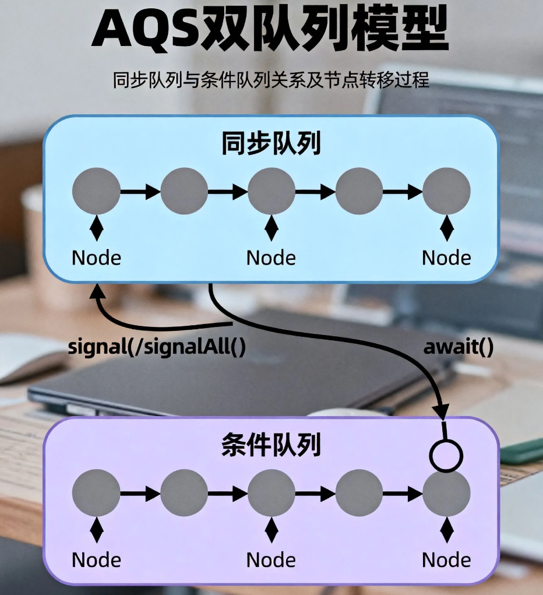
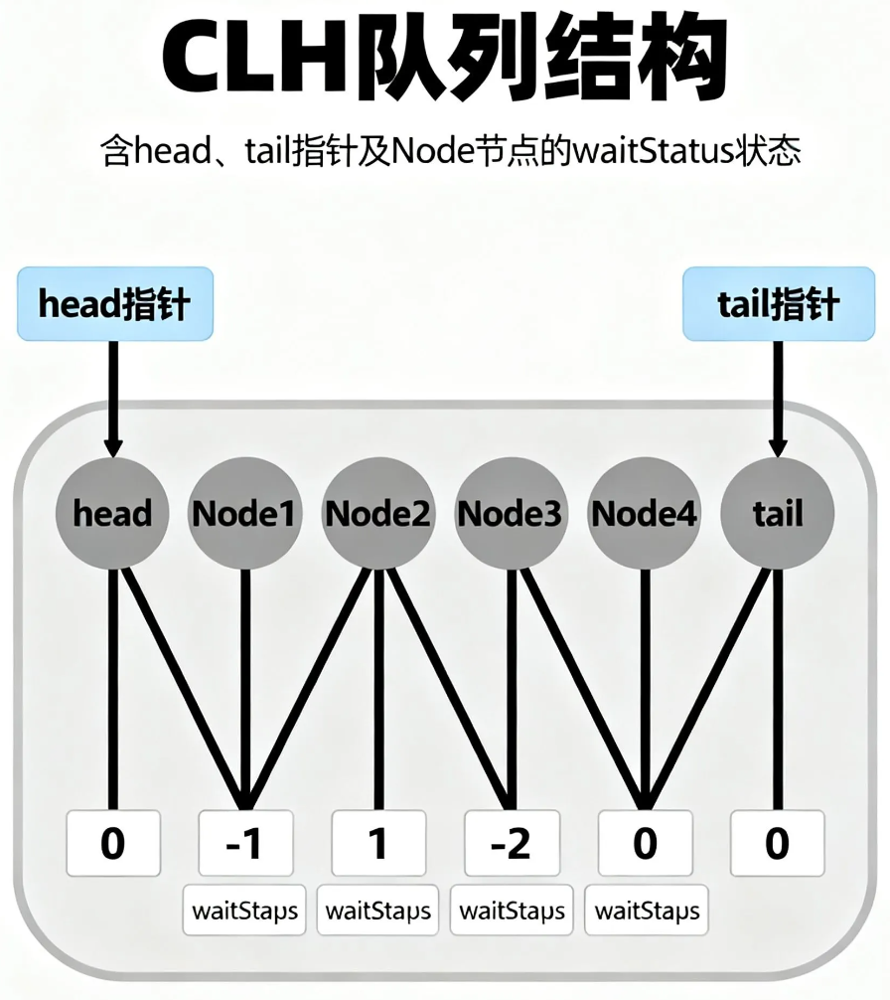
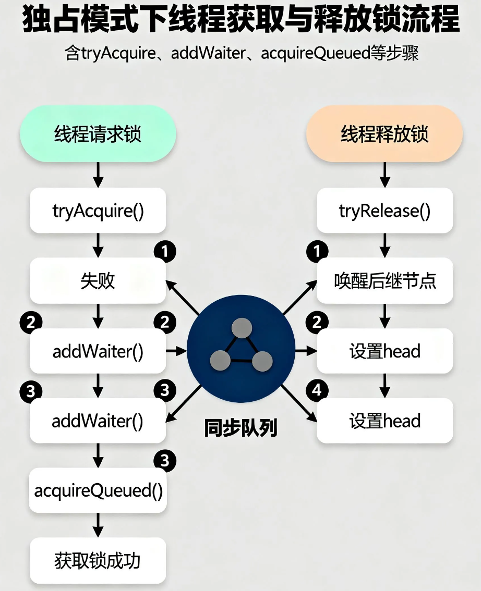
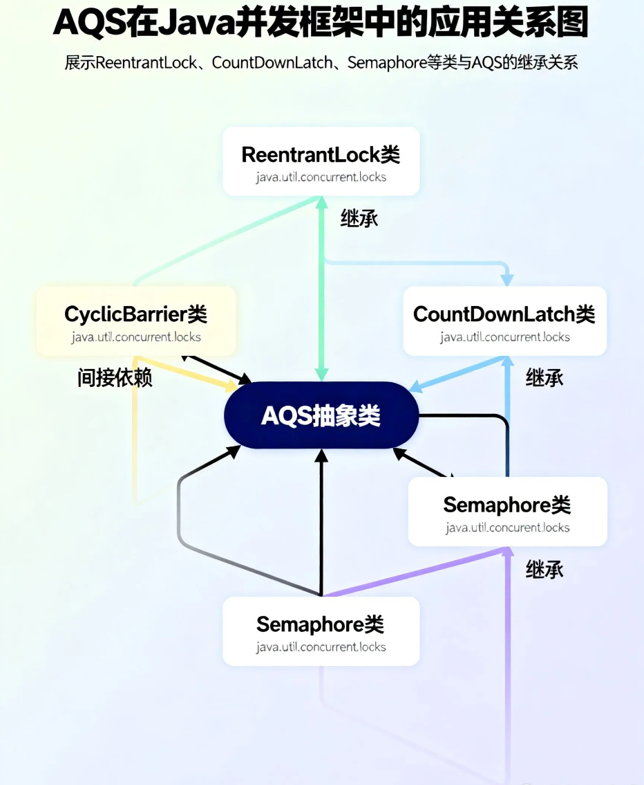

## 一、引言：并发编程中的同步机制挑战
在多线程并发场景中，线程间的协调与同步是保证系统正确性的核心挑战。传统的 synchronized 关键字作为 Java 早期的同步解决方案，虽然提供了基础的互斥能力，但在复杂并发控制需求下逐渐暴露其局限性。这些局限性主要体现在三个关键维度：**无法响应中断**，当线程陷入阻塞等待时无法通过外部信号唤醒；**缺乏超时获取机制**，无法设置获取锁的最大等待时间；**不支持多条件等待**，单一锁对象只能关联一个等待队列，难以满足复杂状态转换场景。

> **<u>核心动机</u>**<u>：Doug Lea 设计 AQS（AbstractQueuedSynchronizer）的本质目标，在于构建一个</u>**<u>通用的同步器基座</u>**<u>，而非具体的锁实现。这一框架通过抽象化同步状态管理、线程排队机制和条件等待等核心能力，为 Java 并发工具类（如 ReentrantLock、Semaphore、CountDownLatch 等）提供统一的底层支持，彻底解决了 synchronized 在扩展性和功能完备性上的固有缺陷。</u>
>

AQS 的设计哲学体现了"**组件化抽象**"的思想——将同步器的共性逻辑（如 FIFO 等待队列管理、 CAS 操作封装）与个性化逻辑（如独占/共享模式切换、状态判断条件）分离，通过模板方法模式允许子类灵活定制同步规则。这种架构不仅大幅降低了并发工具的实现复杂度，更确保了各类同步器在基础行为上的一致性和可靠性，成为 Java 并发编程体系的重要基石。

## 二、AQS的核心设计思想
### 2.1 模板方法模式的架构价值
模板方法模式在 AQS 架构中实现了**框架与业务逻辑的深度解耦**。AQS 作为线程同步框架层，固化了入队、阻塞、唤醒等通用流程，而将状态判断等特定逻辑通过钩子方法（如 tryAcquire、tryRelease）交由子类实现。这种设计使 ReentrantLock 和 CountDownLatch 等同步器能基于同一框架快速开发，既复用核心代码又保持策略灵活性，完美平衡了代码复用与扩展性需求。

> **<u>核心价值体现</u>**<u>：AQS 通过预定义执行骨架（模板方法）与开放策略接口（钩子方法）的组合，使子类仅需关注差异化逻辑实现，大幅降低同步器开发复杂度。</u>
>

### 2.2 独占与共享的双模式设计
AQS 的双模式设计通过对状态变量 state 的差异化解读实现功能扩展：在**独占模式**下，state 表示资源占有状态，如 ReentrantLock 中用 state > 0 标记锁被持有，且通过递增实现重入机制；在**共享模式**下，state 代表可用资源数量，如 CountDownLatch 中初始化为计数器值，每次 countDown() 操作递减直至零释放所有等待线程。两种模式通过 Node 节点的 EXCLUSIVE/SHARED 标记区分，使同步队列能同时兼容独占式（如锁竞争）和共享式（如信号量）场景，为多样化同步需求提供统一的底层支撑架构。

> **核心差异对比**
>
> + 独占模式：state = 占有状态（0=未占有，>0=已占有/重入计数）
> + 共享模式：state = 资源数量（支持多线程并发获取）
> + 模式标识：通过 Node 节点的模式标记实现队列中不同类型线程的协同管理
>

## 三、同步状态的管理机制
同步状态（state）是 AQS 实现同步逻辑的核心，其设计严格遵循线程安全三要素：**可见性**通过 volatile int state 关键字保证，确保多线程对状态变更的即时感知；**原子性**依赖 Unsafe.compareAndSwapInt 方法实现无锁化状态修改；**有序性**则通过 volatile 的 happens-before 规则避免指令重排风险。

> **状态封装特性**：AQS 将 state 声明为 private volatile int，并通过 protected 访问级别的 getState()、setState(int newState) 和 compareAndSetState(int expect, int update) 方法暴露操作接口，既保证了状态修改的安全性，又为子类提供了灵活的定制空间。
>

在具体实现中，state 的语义由子类定义：ReentrantLock 将其用作重入计数器（初始 0，获取锁递增，释放递减），CountDownLatch 则将其作为倒计时器（初始为线程数，递减至 0 时唤醒等待线程）。这种基于状态的抽象设计，使 AQS 能够支撑多样化的同步场景。

## 四、队列机制的实现原理
### 4.1 Node节点的核心状态设计
Node 节点的核心状态由 waitStatus 字段控制，其核心作用是实现同步队列中的**信号传递机制**。当节点处于 SIGNAL 状态时，表示当前节点需要前驱节点在释放资源时唤醒自己；而 CANCELLED 状态则标记节点因超时或中断等原因已失效，需从队列中移除。

> **<u>关键优化逻辑</u>**<u>：在 shouldParkAfterFailedAcquire 方法中，会将前驱节点的 waitStatus 设为 SIGNAL，确保前驱释放资源时能精准唤醒后继，避免无效唤醒，提升并发性能。</u>
>

需特别注意状态场景区分：SIGNAL 仅用于同步队列的节点唤醒通知，而 CONDITION 状态专属于条件队列，二者不可混淆。这种状态设计使 AQS 能高效管理线程等待与唤醒流程。



### 4.2 CLH队列的入队与出队机制
CLH 队列采用无锁设计实现高效并发控制：入队操作通过 CAS 原子更新 tail 指针，避免传统 synchronized 带来的性能开销；出队时通过 setHead 方法将获取锁的节点设为新头节点，并断开原头节点引用以优化 GC。以 T2 线程 enq 入队为例，其核心逻辑通过自旋与 CAS 结合，在多线程并发场景下确保入队安全性——线程循环尝试 CAS 更新 tail，成功则完成入队，失败则重新读取尾节点重试。



> **<u>核心优势</u>**<u>：无锁特性使队列操作避免上下文切换与阻塞延迟，相比基于 synchronized 的传统锁队列，在高并发场景下可显著提升吞吐量，尤其适合 AQS 这类底层同步框架对性能的严苛要求。</u>
>

## 五、AQS的内部实现细节
### 5.1 独占模式下的状态获取与释放
AQS 独占模式的核心交互围绕状态获取与释放机制展开，其设计通过分层逻辑实现高效资源竞争处理。**获取流程**采用"短路逻辑"优化：首先调用 tryAcquire(int arg) 尝试直接获取资源，成功则立即返回；失败才执行后续的入队阻塞流程。这种设计减少了不必要的队列操作开销，是 AQS 性能优化的关键一环。

以 ReentrantLock 的非公平锁实现为例，nonfairTryAcquire 方法提供两次"插队"机会：首次尝试通过 CAS 修改状态变量，若成功直接获取锁；若失败且当前线程为锁持有者，则执行重入计数累加。这种机制在高并发场景下可显著提升吞吐量，但需注意可能导致线程饥饿问题。

**释放流程**则通过 release(int arg) 方法实现，其核心优化在于条件唤醒机制：仅当 tryRelease 成功释放资源且头节点的 waitStatus 不为 0 时，才调用 unparkSuccessor 唤醒后继节点。此设计避免了无效唤醒操作，降低了上下文切换成本。AQS 源码中 acquire 方法的逻辑结构如下：

```java
public final void acquire(int arg) {
    if (!tryAcquire(arg) &&
    acquireQueued(addWaiter(Node.EXCLUSIVE), arg))
        selfInterrupt();
}
```



上述代码清晰展示了"尝试获取-失败入队"的核心逻辑，其中 acquireQueued 负责后续的队列阻塞管理，而 selfInterrupt 则处理中断状态的恢复，形成完整的异常处理闭环。这种分层设计既保证了核心逻辑的简洁性，又为不同同步器实现提供了灵活扩展空间。

### 5.2 线程的阻塞与唤醒机制
AQS 的线程调度核心依赖于 **LockSupport** 工具类的 park()/unpark() 方法，其与传统的 Object.wait()/notify() 机制存在本质差异。LockSupport 采用 **许可证模型**，无需绑定对象监视器，支持响应中断且可设置超时时间，在并发场景下表现出更高的灵活性和可控性。

> **<u>核心差异对比</u>**
>
> + **<u>监视器依赖</u>**<u>：LockSupport 不依赖 synchronized 同步块，避免了对象监视器的约束</u>
> + **<u>中断响应</u>**<u>：park() 可立即响应线程中断并返回，无需抛出 InterruptedException</u>
> + **<u>超时机制</u>**<u>：支持纳秒级精度的超时控制，比 wait(long) 更精准</u>
> + **<u>唤醒顺序</u>**<u>：unpark() 可在 park() 之前调用，不会丢失唤醒信号</u>
>

在 AQS 的 acquireQueued() 方法中，被唤醒的线程并非直接获得锁，而是重新进入 **自旋竞争** 流程。以原博客中的 T2 线程为例：当持有锁的线程释放资源后，会通过 unparkSuccessor() 唤醒同步队列中的后继节点，T2 线程被唤醒后需再次调用 tryAcquire() 尝试获取锁。这种 **"唤醒-竞争"** 设计确保了锁分配的公平性与高效性，避免了无条件唤醒可能导致的资源浪费，是 AQS 实现高性能并发控制的关键机制之一。

## 六、共享模式的实现机制
共享模式作为 AQS 的核心工作模式之一，与独占模式存在本质差异。在共享模式下，tryAcquireShared 方法通过返回 **剩余资源数**（≥ 0 表示成功获取）而非布尔值来表征获取结果，而 releaseShared 操作可能触发多个等待线程的唤醒，这一特性通过 **PROPAGATE 状态** 实现资源释放的链式传播。

> **<u>核心差异对比</u>**
>
> + **<u>获取逻辑</u>**<u>：共享模式返回剩余资源数（≥ 0 成功），独占模式返回布尔值</u>
> + **<u>释放传播</u>**<u>：共享模式支持多线程唤醒（PROPAGATE 状态），独占模式仅唤醒单个后继节点</u>
> + **<u>资源竞争</u>**<u>：共享模式允许多线程并发持有资源，独占模式资源互斥</u>
>

以 CountDownLatch 为例，其内部 Sync 子类重写 tryReleaseShared 方法，通过 CAS 操作将状态值减 1，当状态变为 0 时返回 true，触发所有等待线程唤醒；而 await 方法则通过 acquireSharedInterruptibly 进入共享模式等待队列。对于 Semaphore，其共享模式实现通过 tryAcquireShared 控制许可数量，支持多线程并发获取许可，当资源充足时多个线程可同时通过。

共享模式的源码实现中，doAcquireShared 方法在获取资源成功后，会检查后继节点是否为共享模式，若满足则通过 setHeadAndPropagate 方法继续唤醒后续节点，形成 **传播式唤醒** 机制，这与独占模式的单次唤醒形成鲜明对比。

## 七、AQS在Java并发框架中的应用
### 7.1 ReentrantLock的公平与非公平实现
ReentrantLock 的公平与非公平实现核心差异在于锁获取策略。非公平锁通过两次插队机会（lock 时 CAS 竞争和 acquire 中 tryAcquire 重试）减少线程切换开销，而公平锁通过 hasQueuedPredecessors 方法严格保证 FIFO 顺序。

> **<u>hasQueuedPredecessors 逻辑</u>**<u>：当同步队列头节点不为尾节点（h != t）且头节点的后继节点不是当前线程时，返回 true，阻止当前线程插队，确保等待队列中线程优先获取锁。</u>
>

架构设计上，非公平锁以牺牲部分公平性换取更高吞吐量，公平锁则以性能损耗为代价保证资源分配的公平性，体现了并发控制中"吞吐量"与"公平性"的经典权衡。

### 7.2 Condition的双队列协作机制
Condition 的双队列协作机制以**节点转移**为核心，实现线程在同步队列与条件队列间的有序交互。当线程调用 await() 方法时，必须确保已持有锁，否则将抛出 IllegalMonitorStateException；此时线程会释放锁并进入条件队列等待。而 signal() 操作则将条件队列中的节点转移回同步队列，使线程重新参与锁竞争。需特别注意的是，被唤醒的线程**并非直接获取锁**，仍需通过同步队列的竞争机制重新获取，这一设计避免了"唤醒即获取"的常见误解，确保了多线程环境下的锁分配公平性与状态一致性。

> **<u>核心流程要点</u>**<u>：</u>
>
> 1. **<u>前置条件</u>**<u>：await() 必须在持有锁时调用</u>
> 2. **<u>状态转换</u>**<u>：释放锁 → 进入条件队列 → 被唤醒后转移至同步队列</u>
> 3. **<u>竞争机制</u>**<u>：signal() 后需重新竞争锁，无优先级保证</u>
>

### 7.3 CountDownLatch与Semaphore的实现原理
CountDownLatch 基于 AQS 共享模式实现“倒计时”协作：初始化时将 state 设为计数阈值，调用 countDown() 方法通过 releaseShared(1) 原子递减 state，当 state 归零时唤醒所有等待线程；await() 方法则通过 acquireSharedInterruptibly(1) 进入共享模式等待队列，直至 state 为 0 时被唤醒。

Semaphore 采用 AQS 共享模式实现“许可”管理：state 代表剩余许可数量，acquire(n) 通过 acquireSharedInterruptibly(n) 尝试获取 n 个许可（state 需 ≥ n），获取失败则进入等待队列；release(n) 通过 releaseShared(n) 释放 n 个许可并唤醒队列线程。两者通过定制 AQS 共享模式的同步逻辑，分别实现“计数等待”与“资源限流”功能，展现了 AQS 框架的灵活适配性。

> **<u>核心差异</u>**<u>：CountDownLatch 计数单向递减不可重置，适用于一次性等待事件；Semaphore 许可可动态增减，支持循环复用的资源控制场景。</u>
>



## 八、使用场景与最佳实践
AQS 作为 Java 并发编程的基础框架，其设计灵活性使其能够支持多样化的同步需求。根据资源访问特性，其核心使用场景可分为独占模式与共享模式两大类，在实际应用中需结合场景特性选择最优实现策略。

### 8.1 场景分类
**独占模式**适用于资源互斥访问场景，典型应用如临界区保护。在该模式下，同步状态 state 通常被设计为二元值（0 表示未锁定，1 表示锁定），确保同一时刻仅有一个线程能够获取资源。例如，ReentrantLock 通过独占模式实现线程间的互斥执行，避免多线程同时修改共享数据导致的一致性问题。

**共享模式**则支持多个线程并发访问资源，主要应用于两类场景：一是资源池控制，如数据库连接池通过控制 state 表示可用连接数量，实现多线程对有限资源的合理分配；二是线程协作，如 CountDownLatch 和 CyclicBarrier 利用共享模式实现多个线程的同步等待，当 state 达到预设阈值时唤醒所有等待线程。

### 8.2 最佳实践
在基于 AQS 进行并发编程时，需遵循以下实践原则以确保性能与可靠性：

> **<u>非公平锁的吞吐量优势</u>**<u>：在无特殊公平性要求的场景下，优先选择非公平锁实现。非公平锁通过允许线程直接尝试获取锁（而非严格排队），减少线程切换开销，在高并发场景下可显著提升系统吞吐量。例如，ReentrantLock 的默认实现即为非公平锁，其性能通常优于公平锁配置。</u>
>

**锁粒度控制**是优化并发性能的关键。应避免将过大范围的代码块纳入同步控制，建议通过拆分锁对象或使用 ConcurrentHashMap 等细粒度并发容器，降低锁竞争概率。例如，将一个全局锁拆分为多个局部锁，使不同线程可同时访问不同资源分区。

**Condition 多条件唤醒**机制可有效减少无效唤醒。通过创建多个 Condition 对象，线程可根据特定条件等待或唤醒，避免传统 wait/notify 机制中所有等待线程被唤醒后再次竞争锁的性能损耗。例如，ArrayBlockingQueue 分别为生产者和消费者定义不同 Condition，实现精准的线程通信。

**自定义同步器的 state 设计**需充分利用其整数特性。可通过位运算对 state 进行分段复用，例如使用低 16 位表示资源数量，高 16 位表示其他状态信息（如重入次数或等待队列长度）。这种设计在 ReentrantReadWriteLock 中得到应用，其通过 state 的高 16 位表示读锁数量，低 16 位表示写锁状态，实现读写锁的高效共存。

以上实践均基于 AQS 的核心设计原理，通过合理利用其状态管理与队列机制，可在保证线程安全的同时最大化系统并发性能。在实际开发中，应根据具体业务场景选择合适的同步模式，并结合性能测试验证优化效果。

## 九、总结与演进展望
AQS 作为 Java 并发框架的基石，其核心贡献在于构建了统一的同步器实现标准，大幅降低了并发工具的开发门槛，并为 J.U.C 组件提供了高性能支撑。其架构设计展现了卓越的抽象能力与工程美学，通过模板方法模式与 FIFO 等待队列的巧妙结合，实现了同步状态管理与线程调度的完美解耦。

> **<u>技术演进方向</u>**<u>：随着硬件架构发展，AQS 可能引入基于 CPU 缓存特性的队列节点布局优化，以适应多核与 NUMA 架构；在软件层面，Project Loom 虚拟线程的普及将要求阻塞机制进行轻量化改造，以匹配轻量级线程模型的调度需求。</u>
>

这些潜在优化并非对现有架构的颠覆，而是在保持设计精髓基础上的适应性演进，AQS 作为并发编程基础设施的核心地位仍将长期延续。