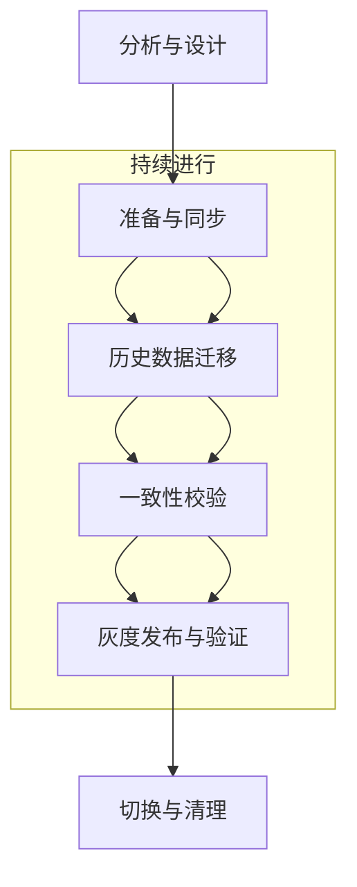

本文以一个常见的数据优化场景——大规模键（大 Key）治理——为切入点，系统性地提炼并提出了一套通用的数据迁移方法论。旨在为开发人员提供一个清晰的行动框架，以从容应对复杂的数据迁移挑战，最终实现平滑、无损且具备回滚能力的“无感”迁移。我们将深入剖析从**分析与设计、双写同步、历史数据迁移、一致性校验、灰度发布与验证**，直至**最终切换与清理**的完整生命周期，并提供可落地的工程实践指南。  

---

### **一、 引言：问题的根源与普遍性挑战**
#### **1. 起源：一次由大 Key 引发的线上事故**
深夜，告警系统发出刺耳的警报，核心业务接口延迟急剧攀升，部分用户请求超时。经过紧急排查，根源指向 Redis 中的一个庞大键（Key）——一个体积高达数百 MB，用于存储某活跃用户全量信息的 Hash 结构。这个“大 Key”不仅阻塞了 Redis 的单线程模型，导致其他请求长时间排队，还造成了严重的内存压力，甚至在集群扩缩容时引发了数据分片迁移的难题。

这便是典型的“大 Key 之痛”。虽然通过业务逻辑拆分 Key 能够暂时缓解症状，但它揭示了一个更深层次的架构问题：**如何将线上生产环境的数据模型，从一种次优设计平滑、无损地迁移至新的、更合理的架构之上？** 这不仅是解决单一技术痛点，而是所有系统演进过程中必须面对的普遍性挑战——**数据迁移**。

#### **2. 数据迁移的核心挑战**
数据迁移的复杂性远超“数据复制”。它更像是一场为持续运行的系统执行的精密“心脏搭桥手术”，要求在服务不中断的前提下完成底层数据结构的替换。在此过程中，工程师必须直面以下挑战：

- **业务连续性** (Business Continuity)：如何最小化甚至消除服务停机时间（Downtime），确保在迁移过程中服务持续可用？
- **数据一致性** (Data Consistency)：在新旧系统并存的过渡期，如何保证两侧数据状态的实时同步与最终一致？
- **数据完整性** (Data Integrity)：如何确保迁移过程无数据丢失、无数据损坏，保证每一条记录的准确性？
- **风险可控性** (Risk Controllability)：如何设计健壮的迁移方案以应对网络波动、程序缺陷等异常，并具备分钟级的快速回滚能力？
- **方案通用性** (Generality)：这套方法论是否能够抽象并适用于不同的存储介质（如 Redis 到 Redis Cluster、MySQL 到 TiDB）和多样的业务场景？

为系统性地应对上述挑战，我们构建了一套标准化的数据迁移框架——**数据迁移六步法**。

---

### **二、 核心方法论：数据迁移六步法**
该方法论将完整的数据迁移生命周期划分为六个定义清晰、循序渐进且风险可控的阶段，为复杂的迁移工程提供明确的导航。

1. **阶段一：分析与设计 (Analysis & Design)** - 谋定而后动，定义迁移目标与技术路径。
2. **阶段二：双写同步 (Dual-Write Synchronization)** - 建立增量数据同步通道，确保新旧系统数据实时一致。
3. **阶段三：历史数据迁移 (Historical Data Migration)** - 对存量数据进行安全、高效的搬迁。
4. **阶段四：一致性校验 (Consistency Verification)** - 通过数据比对与对账，验证迁移的准确性。
5. **阶段五：灰度发布与验证 (Canary Release & Validation)** - 小流量、分阶段地将读写请求切换至新系统，验证其稳定性与性能。
6. **阶段六：切换与清理 (Switch-over & Cleanup)** - 完成流量的最终切换，并安全下线旧系统。

**标准流程示意图:**


---

### **三、 实践详解：深入六大阶段**
#### **第一阶段：分析与设计——奠定成功基石**
这是迁移工程的战略规划阶段，其决策质量直接决定项目成败。

+ **现状诊断(Current-State Assessment)** ：
    - **问题识别**：使用 `redis-cli --bigkeys` 等工具或自研脚本，结合业务场景定义大 Key 标准（例如，String > 10KB, 集合类型元素数 > 5000），进行全面扫描。
    - **模型分析**：深入分析现有数据结构、读写 QPS、访问模式（Access Pattern）及性能瓶颈。
+ **新方案设计(Future-State Design)** ：
    - **结构优化**：例如，将大 Hash `user:{id}` 拆分为 `user:{id}:base`、`user:{id}:profile` 等多个细粒度的 Key。对于数据库，可能涉及垂直拆分、水平分片（分库分表）、索引优化或字段类型变更。
    - **定义 SLO/SLI**：为新系统设定明确的服务等级目标（SLO），如 P99 延迟、错误率等，作为后续验证的基准。
+ **迁移方案评审(Plan Review)** ：
    - **范围界定**：明确定义迁移的数据表、Key 范围、涉及的业务模块。
    - **技术选型**：评估采用自研迁移脚本，还是利用成熟的开源/商业工具（如 Debezium, Canal, AWS DMS, DataX）。
    - **风险预案 (Contingency Plan)** ：制定详细的应急预案，例如，新系统性能不达标的回滚策略、双写逻辑缺陷的修复流程等(阿里变更三板斧)。

#### **第二阶段：双写同步——构建增量数据通道**
双写机制是保障业务连续性和数据零丢失的核心。启用后，所有数据变更将同步写入新旧两个存储系统。

+ **实现策略**：
    - **业务层双写**：在业务逻辑中直接调用新旧存储的写接口。优点是实现简单，缺点是对业务代码有侵入性，耦合度高。
    - **中间件/代理层双写（推荐）**：构建统一的数据访问层（DAL）或数据库代理（Proxy），将双写逻辑封装其中，对上层业务透明。
    - **基于 Binlog 的异步双写**：利用 Canal/Debezium 等工具订阅并解析旧库的 Binlog，将数据变更消息投递至消息队列（如 Kafka），由消费者异步写入新库。此方案与业务逻辑解耦，但存在数据延迟。
+ **挑战与对策**：
    - **原子性**：保证新旧写操作的原子性（分布式事务）成本极高。工程上通常采用**补偿机制**，优先保证主存储（旧库）写入成功。
    - **失败处理**：若新库写入失败，应通过详细日志记录、消息队列重试、或后台任务进行补偿。**核心原则：优先保障服务可用性，再通过补偿机制保证数据的最终一致性。**
    - **性能影响**：同步双写会增加写请求的延迟。必须进行充分的性能压测，评估对线上服务的影响。

#### **第三阶段：历史数据迁移——高效搬迁存量数据**
双写机制解决了增量数据同步问题，此阶段专注于处理庞大的历史存量数据。

+ **迁移策略**：普遍采用**离线全量扫描 + 增量数据同步**的组合策略。
+ **无损迁移实现**：
    1. **前置条件**：**必须先启动双写机制**，确保迁移窗口期内产生的新数据能够同步至新库。
    2. **执行全量迁移**：编写幂等的、可断点续传的迁移脚本。
        * **分批处理 (Batching)** ：按主键范围或时间戳分批次读取数据，避免对源库造成冲击。
        * **限流 (Rate Limiting)** ：迁移脚本需具备限流能力，控制读写速率。
        * **断点续传 (Resumability)** ：记录已完成的迁移批次，确保任务在意外中断后可从断点处继续，无需重头开始。
    3. **处理数据覆盖问题**：全量迁移期间，双写机制写入新库的数据，可能被迁移脚本中的旧数据覆盖。解决方案：
        * **基于版本号/时间戳**：写入数据时携带版本号或最后更新时间戳，仅在版本更高或时间戳更新时才执行覆盖操作。
        * **写入时检查**：在写入新库前，先查询目标数据是否存在。若存在，则跳过。此方案适用于“创建后少更新”的场景。

#### **第四阶段：一致性校验——建立数据信任**
校验是验证迁移成果、建立信心的唯一途径。

+ **离线全量校验**：在业务低峰期，将新旧数据源的数据导出至数据仓库（如 Hive, S3）进行全量比对。适用于数据量不大或对实时性要求不高的场景。
+ **在线实时抽样校验**：
    - **双读校验**：在灰度阶段，同时读取新旧数据源，业务逻辑以旧库结果为准，但在后台异步比对两者差异并上报。
    - **独立校验服务**：编写独立的校验程序，按特定规则（如用户 ID 哈希）持续抽取线上数据，实时对比新旧库的记录。
+ **数据对账与修复 (Reconciliation)** ：建立一个记录不一致数据的“对账池”。根据预设规则（例如，始终以旧库为准），进行自动化或半自动化的数据修复。

#### **第五阶段：灰度发布与验证——稳健的流量切换**
在数据一致性得到保证后，可以逐步将真实流量引入新系统。

+ **读流量灰度**：写操作维持双写，读操作逐步切换至新系统。
    - **双读策略**：应用层同时读取新旧数据源。初期以旧数据源结果为准返回，后台记录并分析两者结果的差异。这是发现数据不一致问题的最后防线。
    - **切流策略**：利用配置中心或服务网格（Service Mesh），实现精细化的流量调度。
        * **按百分比**：1% → 10% → 50% → 100%。
        * **按维度（蓝绿发布）**：先切换内部用户 → 再按用户 ID 哈希值切换部分普通用户 → 最终全量。
    - **黄金指标监控**：在灰度期间，必须密切监控新系统的**延迟（Latency）、错误率（Errors）、吞吐量（Throughput）**（即 Google SRE 提出的三大黄金指标）以及核心业务指标。任何异常波动都应立即触发回滚。

#### **第六阶段：切换与清理——完成使命**
当新系统承载 100% 读流量并稳定运行一段预设时间（如 72 小时）后，即可执行最终切换。

+ **写流量切换 (Final Cutover)** ：
    - **关闭双写**：通过配置中心，原子性地关闭双写开关，所有写流量仅写入新系统。这是整个迁移过程中风险最高的步骤，通常选择在业务低峰期执行。
    - **切换检查清单 (Checklist)** ：准备一份详尽的切换操作清单，明确每一步的负责人、验证方法、回滚指令，并提前演练。
+ **迁移后工作 (Post-Migration)** ：
    - **观察期**：在切换完成后的数天内，保持最高级别的监控和应急响应。
    - **旧系统下线**：确认新系统完全稳定可靠后，按计划备份旧数据、下线旧存储系统，释放资源。
    - **复盘总结 (Retrospective)** ：召开项目复盘会，将迁移过程中的经验、教训、自动化脚本、监控仪表盘等沉淀为团队的标准化资产。

---

### **四、 案例分析： Redis 大 Key 在线重构实战**
本节我们将以一个具体的 Redis 大 Key 治理场景为例，详细演示如何应用“数据迁移六步法”完成一次平滑、无损的线上迁移。

+ **场景背景**：一个核心业务使用 Redis Hash 结构存储了百万级的用户信息，所有数据均存放在单一的 Key `user:info:all` 中。`field` 为用户 ID (uid)，`value` 为用户信息的 JSON 字符串。
+ **迁移目标**：将这个巨大的 Hash Key 拆分为 100 个更小的 Hash Key，以降低单 Key 负载，提升 Redis 性能和稳定性。

#### **第一阶段：分析与设计——制定拆分策略**
+ **现状诊断**：`user:info:all` 这个 Key 体积庞大，任何对其进行的全量操作（如 `HGETALL`）都可能导致 Redis 阻塞。此外，它也是集群数据迁移和内存管理的潜在热点和瓶颈。
+ **新方案设计**：
    - **拆分逻辑**：采用哈希分片（Sharding）策略，将原有的单个大 Key 拆分为 100 个小 Key，命名规则为 `user:info:0` 至 `user:info:99`。
    - **分片算法**：通过用户 ID (uid) 计算其所属的分片 ID，公式如下：

> shard_id = hash(uid) mod 100
>
> 这样，每个新 Key 大致存储约 1 万名用户信息，将压力均匀分散。
>

#### **第二阶段：双写同步——保障增量数据一致**
为确保在迁移过程中，所有新的数据变更都能同时体现在新旧数据结构中，我们在应用层引入了双写机制。

+ **实现策略**：修改数据写入的相关业务逻辑，使其在更新数据时，同时写入新的分片 Key 和旧的全量 Key。

```java
// 伪代码：双写逻辑
public void updateUserInfo(Long uid, UserInfo info) {
    String userInfoJson = JSON.toJSONString(info);

    // 1. 计算分片ID，写入新Key
    int shardId = Math.abs(uid.hashCode() % 100);
    String newKey = "user:info:" + shardId;
    redis.hset(newKey, uid.toString(), userInfoJson);

    // 2. 同时写入老Key（兼容旧逻辑）
    String oldKey = "user:info:all";
    redis.hset(oldKey, uid.toString(), userInfoJson);
}
```

+ **核心作用**：在整个迁移过渡期，旧 Key 继续为线上读请求提供服务，而新 Key 集合通过双写机制逐步积累起与旧 Key 同步的增量数据，为后续的全量迁移和切换奠定基础。

#### **第三阶段：历史数据迁移——执行非阻塞式搬迁**
此阶段的目标是将旧 Key 中的存量数据安全、高效地迁移至新的分片 Key 中。

+ **迁移策略**：采用后台任务结合分批处理的方式进行，核心是避免对线上 Redis 服务造成阻塞。
+ **实现细节**：利用 Redis 的 `HSCAN` 命令代替 `HGETALL`，进行渐进式扫描和迁移。`HGETALL` 会一次性加载整个 Hash，对于大 Key 极易导致 Redis 线程阻塞，引发线上故障。

```python
# 伪代码：Python 后台迁移脚本
import redis
import time

r = redis.Redis(host='localhost', port=6379, db=0)
old_key = "user:info:all"
shard_count = 100
cursor = '0' # HSCAN的游标初始值为'0'

while cursor != 0:
    # 1. 渐进式扫描老Key（每次扫描1000个field，避免阻塞）
    cursor, fields = r.hscan(old_key, cursor=cursor, count=1000)

    # 2. 按分片规则组织数据
    shard_data = {}
    for uid_bytes, info_bytes in fields.items():
        uid_str = uid_bytes.decode('utf-8')
        shard_id = abs(hash(uid_str) % shard_count)
        shard_key = f"user:info:{shard_id}"

        if shard_key not in shard_data:
            shard_data[shard_key] = {}
        shard_data[shard_key][uid_str] = info_bytes

    # 3. 使用Pipeline批量写入新Key，减少网络开销
    if shard_data:
        with r.pipeline(transaction=False) as pipe:
            for shard_key, mapping_data in shard_data.items():
                pipe.hset(shard_key, mapping=mapping_data)
            pipe.execute()

    # 4. 每批迁移后短暂休眠，进一步降低Redis压力
    time.sleep(0.1)

print("历史数据迁移完成！")
```

#### **第四、五阶段：灰度发布与验证——稳健的流量切换**
在历史数据迁移完成且双写持续运行后，新 Key 的数据已趋于完整。此时，我们开始分阶段将读流量切换至新 Key。

+ 第一步：抽样校验：

在正式切流前，编写校验脚本，随机抽取 1% 的用户 ID，同时读取新旧 Key 中的数据进行比对，确保数据一致性，建立切换信心。

+ 第二步：读流量灰度切换：

利用配置中心动态控制流量切换比例，实现小步快跑、稳妥验证。

```java
// 伪代码：灰度读取逻辑
public UserInfo getUserInfo(Long uid) {
// 从配置中心获取切换比例（0-100）
int switchRatio = config.getInteger("user.info.switch.ratio", 0);

// 按比例决定是否读取新Key
if (ThreadLocalRandom.current().nextInt(100) < switchRatio) {
    int shardId = Math.abs(uid.hashCode() % 100);
    String newKey = "user:info:" + shardId;
    String info = redis.hget(newKey, uid.toString());
    if (info != null) {
        return JSON.parseObject(info, UserInfo.class);
    }
}

// 降级或默认读取老Key（作为兜底）
String oldKey = "user:info:all";
String info = redis.hget(oldKey, uid.toString());
return info != null ? JSON.parseObject(info, UserInfo.class) : null;
}
```

+ **风险兜底与监控**：
    - **多级兜底**：在新 Key 查询失败时，必须有兜底机制：首先降级查询旧 Key；若旧 Key 也失效，可允许查询数据库，并将查询结果异步回写至新 Key。
    - **限流保护**：为防止缓存大量失效导致请求穿透击垮数据库，需对数据库查询接口进行严格限流。
    - **实时监控**：在整个灰度期间，密切监控 Redis 性能（延迟、内存、命中率）和业务指标（接口响应时间、错误率）。

#### **第六阶段：切换与清理——完成使命并释放资源**
当读流量 100% 切换至新 Key 并稳定运行一段时间后，即可进行最后的清理工作。

+ **写流量切换**：停止双写逻辑，所有写操作仅写入新 Key。
+ **旧数据清理**：使用非阻塞命令 `UNLINK` 删除旧的大 Key，避免因 `DEL` 命令在删除巨大对象时造成的服务阻塞。

```bash
# 异步删除老Key，由Redis后台线程处理，不阻塞主线程
127.0.0.1:6379> UNLINK user:info:all
(integer) 1
```

对于体积特别巨大（如数 GB）的 Key，更安全的做法是先通过 `HSCAN` + `HDEL` 分批删除其内部字段，最后再 `UNLINK` 这个近乎为空的 Key 结构。

+ **回滚预案**：整个迁移过程必须具备快速回滚能力。一旦监控到异常，可通过配置中心将读写流量立即切回旧 Key，暂停迁移任务，保障系统稳定。

---

### **五、 总结与展望**
数据迁移是一项高风险、高价值的复杂系统工程。本文提出的六步法，其核心思想可归结为三大工程原则：

+ **可观测性 (Observability)** ：迁移的每一步都必须有明确的数据指标来度量，无论是系统性能还是数据一致性。
+ **可灰度 (Incrementality)** ：小步快跑，渐进式地引入变更，是控制大规模分布式系统风险最有效的方法论。
+ **可回滚 (Reversibility)** ：为每一个关键变更点都设计好详尽的回滚预案。有退路，才有前进的底气。

在工程实践中，我们应最大限度地将迁移、校验等步骤自动化、工具化，以减少人为失误。展望未来，随着云原生技术和 DBaaS（数据库即服务）的成熟，数据迁移的底层操作将变得愈发便捷。然而，其背后的核心工程思想——**确保业务的平滑、数据的无损、过程的可控**——将永远是数据架构师追求的核心目标。

