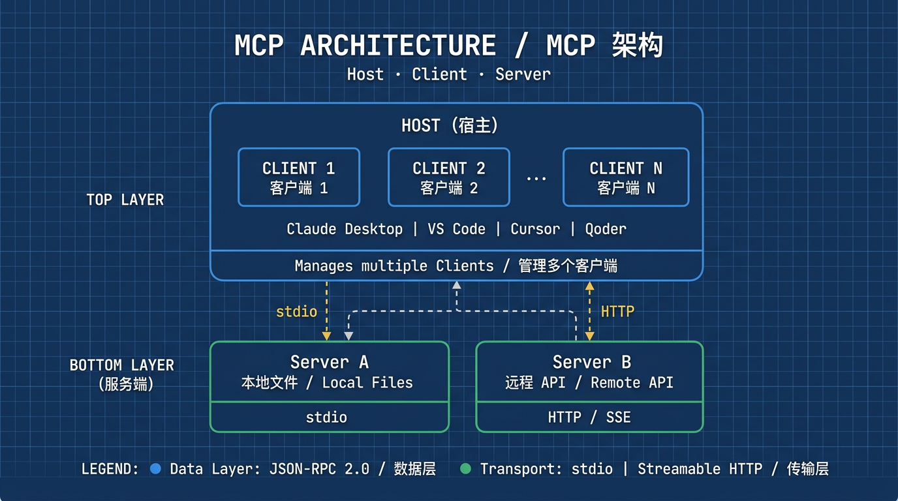
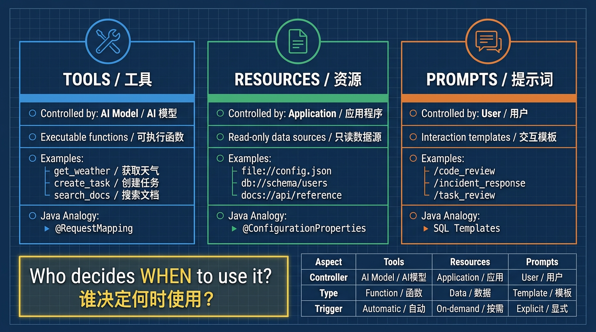
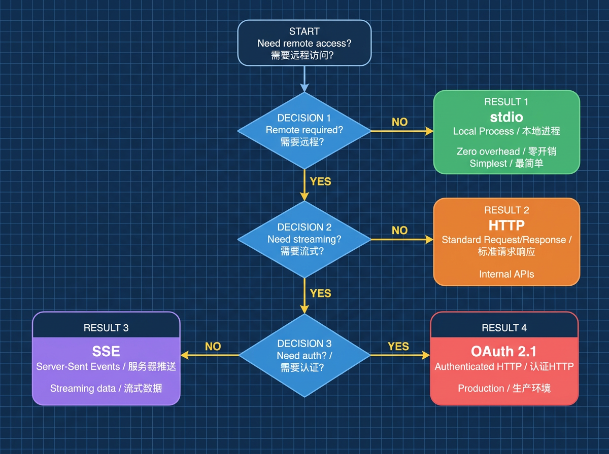
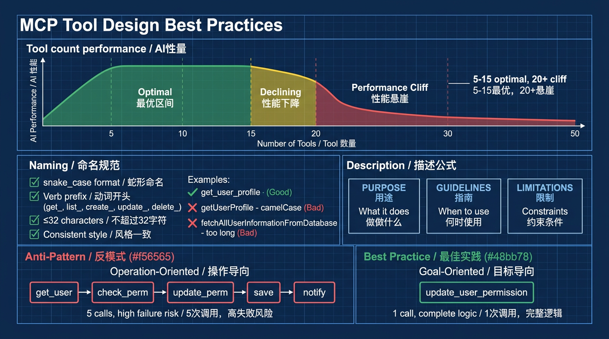
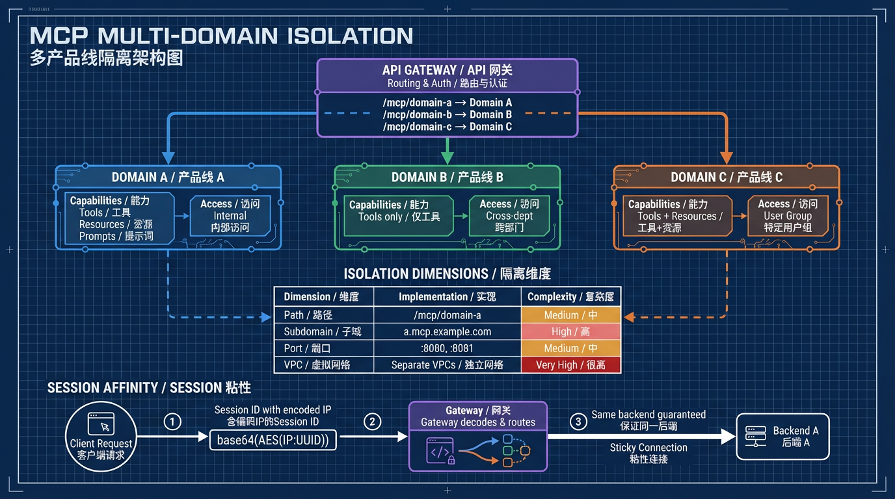

> 30 个 Tool 注册上去，Agent 频繁调错——问题不在协议，在工程实践。

---

## 一个真实的问题

你用 Spring AI 写了第一个 MCP Server。`@Tool` 注解一加，30 多个方法自动注册为 Tool，本地用 Claude Desktop 测了几轮，效果不错。

上线后画风突变：

- Agent 在 30 个 Tool 里频繁选错，查任务的请求被路由到了删除接口
- 有人发现可以通过 Tool 参数绕过权限校验，直接操作不该访问的数据
- 出了问题想排查，日志里只有零散的 `System.out.println`，串不起调用链路
- 两个业务线共用一个 Server，A 线的变更导致 B 线的 Agent 全挂了

这不是个案。MCP 协议本身设计简洁优雅，但从"能跑起来的 demo"到"可在生产环境稳定运行的 Server"，中间差着一整套工程实践。

本文围绕三个层次展开：**是什么**（理解 MCP Server 的本质和架构）、**怎么做**（用 Java 从零开发一个可用的 MCP Server）、**如何做更好**（生产级的工程实践和多域隔离方案）。帮你建立一套系统化的 MCP Server 开发认知，而不仅仅是跑通一个 Hello World。

---

## 第一部分：是什么 —— 理解 MCP Server

### 1. MCP 解决的核心问题

AI Agent 需要与外部世界交互——查数据库、调 API、读文件、发消息。在 MCP 之前，这个问题的解决方案是碎片化的：

- OpenAI 的 Function Calling 需要每个应用自己实现函数注册和调用逻辑
- LangChain 的 Tool 机制绑定了特定框架
- 各家 Agent 框架各自定义工具接口，互不兼容

同一个"查天气"的能力，接入 Claude 要写一遍，接入 GPT 要写一遍，接入开源 Agent 又要写一遍。

MCP 的定位是：**一个标准化的协议**，让 AI 应用和外部能力之间有统一的对接方式。

这对 Java 程序员来说并不陌生。类比一下：

- **MCP 之于 AI 工具调用，类似 JDBC 之于数据库访问**——你不需要为 MySQL 和 PostgreSQL 分别写连接代码，JDBC 提供了统一抽象
- **类似 Servlet 规范之于 Web 容器**——定义标准接口，Tomcat、Jetty 都能跑

从 2024 年底 Anthropic 开源 MCP 至今，GitHub 上已涌现超过 13,000 个 MCP Server 实现。Claude Desktop、VS Code、Cursor、Qoder 等主流 AI 工具都已原生支持。Spring AI 从 1.0 M4 开始提供了完整的 MCP Boot Starter。协议的快速采纳说明市场对标准化的渴求。

### 2. MCP 架构速览
#### 三个角色

MCP 采用经典的客户端-服务端架构，但引入了一个"Host"的概念：

- **Host（宿主）**：AI 应用本身，比如 Claude Desktop、VS Code。负责管理一个或多个 Client
- **Client（客户端）**：由 Host 创建，每个 Client 维护与一个 Server 的连接
- **Server（服务端）**：提供具体能力的程序。可以在本地运行（stdio），也可以在远程运行（HTTP）

```
┌──────────────────────────────────────┐
│        Host（如 Claude Desktop）       │
│                                      │
│  ┌──────────┐  ┌──────────┐         │
│  │ Client 1 │  │ Client 2 │  ...    │
│  └────┬─────┘  └────┬─────┘         │
└───────┼──────────────┼───────────────┘
        │              │
   ┌────▼─────┐  ┌────▼──────┐
   │ Server A │  │ Server B  │
   │（本地文件）│  │（远程 API）│
   └──────────┘  └───────────┘
```

用 Spring 的视角理解：Host 类似于一个 Web 应用容器，Client 类似于 `RestTemplate` / `WebClient`，Server 类似于你写的 REST 服务。

#### 两层设计

- **数据层**：基于 JSON-RPC 2.0，定义消息结构、生命周期管理（初始化 → 能力协商 → 调用 → 通知）、以及三大原语
- **传输层**：定义通信方式。支持 stdio（本地进程间通信）和 Streamable HTTP（远程通信，支持 SSE 流式）

数据层是内层，定义"说什么"；传输层是外层，定义"怎么说"。这种分离意味着同一套 JSON-RPC 消息可以跑在任何传输方式上——跟 Spring MVC 的 Controller 代码不关心底层是 Tomcat 还是 Netty 是同一个道理。

#### 三大原语

这是 MCP 最核心的设计。Server 通过三种原语向 Client 暴露能力：

| 原语 | 控制方 | 含义 | 典型场景 | Java 类比 |
|------|--------|------|---------|-----------|
| **Tools** | AI 模型决定何时调用 | 可执行的函数 | 查天气、写文件、调 API | `@RequestMapping` 处理的业务方法 |
| **Resources** | 应用程序决定何时获取 | 只读数据源 | 文件内容、数据库 Schema | `@ConfigurationProperties` 暴露的配置 |
| **Prompts** | 用户显式选择使用 | 交互模板 | 代码 Review 模板、故障排查流程 | 预置的 SQL 模板 |

理解这三者的关键在于**谁决定什么时候使用它**：

- **Tools**：AI 模型自主决定调用哪个 Tool、传什么参数。你定义的 Tool 描述是给 AI 看的
- **Resources**：应用程序主动拉取数据。它不是 AI 自动触发的，而是应用侧根据需要获取上下文
- **Prompts**：用户显式选择，比如在 Claude Desktop 中通过 "/" 命令选择一个模板

一个常见误区是把所有能力都做成 Tool。实际上，如果某个数据是用来提供上下文而非执行动作的，用 Resource 更合适。如果某个交互模式是固定的最佳实践，用 Prompt 固化更清晰。

### 3. 什么时候该写 MCP Server

**适合的场景：**

- 你有一个系统或 API，想让 AI Agent 使用它的能力
- 你想把工具能力标准化暴露给多个 AI 应用（写一次，Claude / VS Code / Cursor 都能用）
- 你需要统一的工具发现、调用和权限控制机制

**不太适合的场景：**

- 纯数据查询——如果只是"给 AI 提供文档内容作为参考"，RAG 可能更直接
- 简单的一次性脚本——直接写 Function Calling 更快
- 不需要标准化对接的内部强绑定工具

判断标准：**如果你的工具能力需要被多个 AI 应用消费，或者你希望工具定义与 AI 应用解耦，MCP 就是正确的选择。**

---

## 第二部分：怎么做 —— 用 Java 开发一个 MCP Server

### 4. 开发前的设计决策

#### 4.1 Java 生态的两个选择

在 Java 中开发 MCP Server，有两条路：

| 特性 | Spring AI Boot Starter | MCP Java SDK 手动构建 |
|------|------------------------|---------------------|
| **开发效率** | 开箱即用，`@Tool` 注解自动注册 | 需手动配置 Server、Transport |
| **灵活性** | 仅支持单 Server 实例 | 支持多 Server、多端点 |
| **多域支持** | 不支持 | 原生支持 |
| **适用阶段** | 快速验证 / POC / 单业务域 | 生产环境 / 多业务域 |

**建议**：从 Spring AI Starter 入手快速验证，生产环境如果需要多域隔离再迁移到手动构建。本文先用 Starter 讲清楚核心概念，进阶部分再展开手动构建。

#### 4.2 选什么传输方式


```
需要远程访问吗？
├── 否 → stdio（本地进程通信，零开销，最简单）
└── 是 → Streamable HTTP（WebFlux）
         ├── 需要流式响应？ → 配置 SSE
         └── 需要认证？   → 配置 OAuth 2.1
```

大多数情况下，**先用 stdio 开发和测试，需要远程访问时切换到 WebFlux**。MCP 的两层架构让这个切换很轻量——只需要换一个 Starter 依赖和传输配置。

### 5. 从零开始：一个完整的 MCP Server

以 Spring AI MCP Starter 为例，展示一个包含 Tool、Resource、Prompt 三种原语的完整 Server。

#### 项目依赖

```xml
<parent>
    <groupId>org.springframework.boot</groupId>
    <artifactId>spring-boot-starter-parent</artifactId>
    <version>3.3.x</version>
</parent>

<dependencyManagement>
    <dependencies>
        <dependency>
            <groupId>org.springframework.ai</groupId>
            <artifactId>spring-ai-bom</artifactId>
            <version>1.0.0-M4</version>
            <type>pom</type>
            <scope>import</scope>
        </dependency>
    </dependencies>
</dependencyManagement>

<dependencies>
    <!-- stdio 模式 -->
    <dependency>
        <groupId>org.springframework.ai</groupId>
        <artifactId>spring-ai-starter-mcp-server</artifactId>
    </dependency>
    <!-- 如果需要 HTTP 模式，改用 -->
    <!-- spring-ai-mcp-server-webflux-spring-boot-starter -->
    
    <dependency>
        <groupId>org.springframework</groupId>
        <artifactId>spring-web</artifactId>
    </dependency>
</dependencies>
```

#### Tool 定义：AI 模型控制

```java
@Service
public class ProjectTools {

    private final TaskService taskService;

    public ProjectTools(TaskService taskService) {
        this.taskService = taskService;
    }

    @Tool(description = "列出项目中的任务。"
        + "适用于需要查看项目待办、分配情况的场景。"
        + "返回任务 ID、标题、负责人和状态。")
    public String list_tasks(
            @ToolParam(description = "项目 ID") String projectId,
            @ToolParam(description = "任务状态过滤：open, closed, all。默认 open") 
            String status) {
        
        List<Task> tasks = taskService.findByProject(projectId, status);
        if (tasks.isEmpty()) {
            return String.format("项目 %s 中没有 %s 状态的任务。", projectId, status);
        }
        return tasks.stream()
            .map(t -> String.format("- [%s] %s (%s) - %s", 
                t.getId(), t.getTitle(), t.getAssignee(), t.getStatus()))
            .collect(Collectors.joining("\n"));
    }

    @Tool(description = "在项目中创建新任务。"
        + "创建后返回任务 ID 和详情。"
        + "注意：title 不能为空，assignee 可选。")
    public String create_task(
            @ToolParam(description = "项目 ID") String projectId,
            @ToolParam(description = "任务标题") String title,
            @ToolParam(description = "任务描述，可选") String description,
            @ToolParam(description = "负责人，可选") String assignee) {
        
        Task task = taskService.create(projectId, title, description, assignee);
        return String.format("任务已创建：\n- ID：%s\n- 标题：%s\n- 负责人：%s\n- 状态：待开始",
            task.getId(), task.getTitle(), task.getAssignee());
    }

    @Tool(description = "搜索项目文档库中的内容。"
        + "在全文索引中搜索匹配的文档。"
        + "适用于关键词检索场景，不适合已知文件名的精确查找（请使用 get_document）。"
        + "仅支持纯文本文档，max_results 上限 50。")
    public String search_documents(
            @ToolParam(description = "搜索关键词，支持自然语言") String query,
            @ToolParam(description = "返回结果上限，默认 10，最大 50") int maxResults) {
        
        List<Document> results = docService.search(query, Math.min(maxResults, 50));
        if (results.isEmpty()) {
            return "未找到匹配的文档。尝试更换关键词或放宽搜索条件。";
        }
        return results.stream()
            .map(d -> String.format("- [%s] %s (相关度: %.0f%%)", 
                d.getId(), d.getTitle(), d.getScore() * 100))
            .collect(Collectors.joining("\n"));
    }
}
```

**关键设计点**：`@Tool` 的 description 不是写给你看的，**是写给 AI 模型看的**。AI 根据这段描述决定什么时候调用这个 Tool、传什么参数。`@ToolParam` 的 description 同理——它就是 JSON Schema 中的参数说明。

#### Resource 定义：应用程序控制

Resource 提供 AI 需要"阅读"但不需要"执行动作"的上下文数据。在 Spring AI MCP 中，通过实现 `McpResourceProvider` 或直接注册 `SyncResourceSpecification` 来定义：

```java
@Component
public class ProjectResources {

    private final ProjectService projectService;
    private final SchemaService schemaService;

    // ========== 静态 Resource：固定 URI，提供全局上下文 ==========

    /**
     * 暴露 API 文档，供 AI 理解系统能力和数据结构
     * URI: docs://api/reference
     */
    @Bean
    public SyncResourceSpecification apiDocResource() {
        return SyncResourceSpecification.builder()
            .uri("docs://api/reference")
            .name("API Reference")
            .description("项目管理系统的 API 文档，包含所有接口定义和数据模型说明。"
                + "AI 可以参考此文档理解系统能力和数据结构。")
            .mimeType("text/markdown")
            .handler(exchange -> {
                String apiDoc = loadApiDocumentation();
                return new ReadResourceResult(List.of(
                    new TextResourceContents(exchange.uri(), "text/markdown", apiDoc)
                ));
            })
            .build();
    }

    // ========== 动态 Resource Template：参数化 URI ==========

    /**
     * 按项目 ID 获取 README
     * URI: project://{projectId}/readme
     */
    @Bean
    public SyncResourceTemplateSpecification projectReadmeTemplate() {
        return SyncResourceTemplateSpecification.builder()
            .uriTemplate("project://{projectId}/readme")
            .name("Project README")
            .description("获取指定项目的 README 文件内容，包含项目简介、技术栈和本地开发指南。")
            .handler(exchange -> {
                String projectId = exchange.extractUriVariable("projectId");
                String readme = projectService.getReadme(projectId);
                return new ReadResourceResult(List.of(
                    new TextResourceContents(exchange.uri(), "text/markdown", readme)
                ));
            })
            .build();
    }

    /**
     * 按数据库名获取 Schema 信息
     * URI: database://{dbName}/schema
     */
    @Bean
    public SyncResourceTemplateSpecification dbSchemaTemplate() {
        return SyncResourceTemplateSpecification.builder()
            .uriTemplate("database://{dbName}/schema")
            .name("Database Schema")
            .description("获取指定数据库的表结构信息。包含表名、字段定义、索引和外键关系。"
                + "适合作为 SQL 生成或数据分析的上下文。")
            .handler(exchange -> {
                String dbName = exchange.extractUriVariable("dbName");
                String schema = schemaService.getSchemaDescription(dbName);
                return new ReadResourceResult(List.of(
                    new TextResourceContents(exchange.uri(), "text/plain", schema)
                ));
            })
            .build();
    }
}
```

**Resource 设计的几个原则：**

1. **URI 要有语义层级**。`project://{projectId}/readme` 比 `data://{id}` 清晰得多。好的 URI 就像好的 REST 路径，看 URI 就能猜到返回什么
2. **不要用动词**。Resource 是"名词"——它代表一个数据实体，不是一个操作。`get-readme://{id}` 是错误的，`project://{id}/readme` 是正确的
3. **描述要说清楚数据内容和用途**。AI 或应用根据 description 判断是否需要拉取这个 Resource
4. **区分静态和模板**。全局性的数据（如 API 文档）用静态 URI，按实体变化的数据（如某个项目的 README）用 URI Template

**什么时候用 Resource 而不是 Tool？** 一个判断标准：如果这个数据是为了让 AI "理解背景"而不是"执行动作"，就用 Resource。比如数据库 Schema 信息——AI 需要它来写正确的 SQL，但获取 Schema 本身不算一个"业务动作"。

#### Prompt 定义：用户控制

Prompt 把反复出现的交互模式固化为可复用的模板。用户通过"/"命令或类似机制选择一个 Prompt，AI 就知道该按什么流程工作。

```java
@Component
public class ProjectPrompts {

    /**
     * 任务评审提示词：引导 AI 按标准流程评审项目任务
     */
    @Bean
    public SyncPromptSpecification taskReviewPrompt() {
        return SyncPromptSpecification.builder()
            .name("task_review")
            .description("项目任务评审模板。引导 AI 按标准流程评审待办任务，"
                + "包括描述完整性、分配合理性、优先级排序等维度。")
            .arguments(List.of(
                new PromptArgument("projectId", "项目 ID", true)
            ))
            .handler(exchange -> {
                String projectId = exchange.getArgument("projectId");
                String prompt = String.format("""
                    请作为项目经理，评审项目 %s 中的待办任务：

                    1. 先使用 list_tasks 工具获取所有 open 状态的任务
                    2. 检查每个任务的描述是否清晰、可执行
                    3. 确认任务分配是否合理（是否有人过载、是否有任务无人负责）
                    4. 识别是否有遗漏的关键任务
                    5. 给出优先级排序建议，并说明理由

                    注意：如果任务数超过 20 个，请先按模块分组，再逐组评审。
                    """, projectId);
                return new GetPromptResult(
                    "项目任务评审",
                    List.of(new PromptMessage(Role.USER, new TextContent(prompt)))
                );
            })
            .build();
    }

    /**
     * 故障排查提示词：按标准流程排查线上问题
     */
    @Bean
    public SyncPromptSpecification incidentInvestigationPrompt() {
        return SyncPromptSpecification.builder()
            .name("incident_investigation")
            .description("线上故障排查模板。引导 AI 按标准流程排查服务异常，"
                + "涵盖指标检查、日志分析、变更回溯和根因定位。")
            .arguments(List.of(
                new PromptArgument("serviceName", "服务名称", true),
                new PromptArgument("errorType", "错误类型（如 timeout, 5xx, OOM）", true)
            ))
            .handler(exchange -> {
                String service = exchange.getArgument("serviceName");
                String error = exchange.getArgument("errorType");
                String prompt = String.format("""
                    请按以下步骤排查 %s 的 %s 问题：

                    第一步：查看指标
                    - 使用 get_service_metrics 查看最近 1 小时的错误率和 P99 延迟
                    - 如果错误率超过 50%%，同时使用 get_downstream_health 检查下游依赖

                    第二步：分析日志
                    - 使用 get_recent_logs 获取最近 30 分钟的错误日志
                    - 关注异常堆栈中的根因（root cause），不要只看表层异常

                    第三步：回溯变更
                    - 使用 get_recent_deployments 检查最近 24 小时是否有发布
                    - 使用 get_config_changes 检查是否有配置变更

                    第四步：综合判断
                    - 给出根因判断，说明推理依据
                    - 给出修复建议和风险评估
                    - 如果无法确定根因，明确说明需要进一步排查的方向
                    """, service, error);
                return new GetPromptResult(
                    "故障排查：" + service,
                    List.of(new PromptMessage(Role.USER, new TextContent(prompt)))
                );
            })
            .build();
    }
}
```

**Prompt 设计的价值和原则：**

1. **把团队经验固化为流程**。故障排查怎么做？代码 Review 看什么？这些原本存在于老员工脑子里的知识，通过 Prompt 模板变成了可复用的标准流程
2. **引导 AI 使用 Tool 的顺序和方式**。Prompt 中可以显式引用 Tool 名称，告诉 AI"先用 A 工具查数据，再用 B 工具分析"
3. **参数化设计**。不要硬编码具体的项目名或服务名，用参数让 Prompt 可以适配不同场景
4. **Prompt 不是 Tool**。Prompt 由用户主动选择触发，Tool 由 AI 自主决定调用。两者的控制权不同

#### 启动类和注册

```java
@SpringBootApplication
public class McpServerApplication {

    public static void main(String[] args) {
        SpringApplication.run(McpServerApplication.class, args);
    }

    @Bean
    public ToolCallbackProvider projectTools(ProjectTools tools) {
        return MethodToolCallbackProvider.builder()
            .toolObjects(tools)
            .build();
    }
}
```

```properties
# application.properties
spring.main.banner-mode=off
logging.pattern.console=
```

关闭 banner 和控制台日志格式是因为 stdio 模式下，任何写入 stdout 的内容都会污染 JSON-RPC 消息流——这也是 Java 开发 MCP Server 最常踩的坑。

#### 用 MCP Inspector 验证

```bash
# 构建
./mvnw clean package

# 用 Inspector 测试
npx @modelcontextprotocol/inspector java -jar target/mcp-server-0.0.1-SNAPSHOT.jar
```

Inspector 启动后可以：
- 查看所有暴露的 Tools 及其 Schema
- 手动调用 Tool 并查看返回结果
- 浏览 Resources 列表并读取内容
- 测试 Prompt 模板的渲染结果

**强烈建议在接入任何 AI 客户端之前，先用 Inspector 验证。** 比直接接入 Claude Desktop 调试效率高很多。

### 6. Tool 设计：MCP Server 的核心


Tool 是 MCP Server 中最重要的原语，也是最容易设计出问题的部分。

#### 6.1 命名规范

命名不是小事。对 MCP Tool 来说，名字是 AI 模型理解工具的第一入口。

- **使用 snake_case**：MCP 生态事实标准，超过 90% 的 Tool 使用这种格式。虽然 Java 惯用 camelCase，但 MCP Tool 的名字是给 AI 和多语言客户端看的，应遵循 MCP 社区规范
- **动词开头**：`get_alerts`、`create_task`、`list_projects`
- **控制长度**：<=32 字符
- **保持一致**：整个 Server 内命名风格必须统一

```java
// 好的命名
@Tool(description = "...") public String get_user_profile(...) {}
@Tool(description = "...") public String list_open_tasks(...) {}
@Tool(description = "...") public String create_deployment(...) {}

// 差的命名
@Tool(description = "...") public String getUserProfile(...) {}  // 不是 snake_case
@Tool(description = "...") public String data(...) {}            // 模糊，非动词
@Tool(description = "...") public String fetch_all_user_information_from_database(...) {} // 太长
```

注意：Java 方法名虽然通常是 camelCase，但 `@Tool` 的 name 属性（或方法名映射）最终会作为 MCP 协议中的 Tool 名称暴露给客户端。如果框架默认取方法名，建议用 snake_case 命名方法；或者通过 `@Tool(name = "list_tasks")` 显式指定。

#### 6.2 描述的写法

一项调研显示，**97.1% 的 MCP Tool 描述存在至少一个质量问题**。好的描述应包含三要素：

| 要素 | 说明 | 示例 |
|------|------|------|
| **Purpose** | 这个 Tool 做什么 | "搜索项目文档库中的内容" |
| **Guidelines** | 什么时候该用、输入约束 | "适用于关键词检索场景，不适合已知文件名的精确查找" |
| **Limitations** | 限制和可能的失败 | "仅支持纯文本文档，max_results 上限 50" |

```java
// 差的描述
@Tool(description = "获取用户")  // AI 不知道返回什么、什么时候该用

// 好的描述
@Tool(description = "根据用户 ID 查询用户详细信息，包括姓名、邮箱、角色和所属部门。"
    + "适用于需要确认用户身份或权限的场景。"
    + "如果只需要用户名，请使用 get_user_name 以减少不必要的数据获取。"
    + "用户 ID 格式为 U 开头加 6 位数字，如 U001234。")
```

#### 6.3 数量控制

这是最常见的设计陷阱：把系统所有 API 端点 1:1 映射成 Tool，结果一个 Server 暴露 50+ 个 Tool。

经验数据：

- **5-15 个 Tool**：最优区间，AI 能高效理解和选择
- **超过 20 个**：性能出现明显下降（"工具选择悬崖"）
- **超过 50 个**：几乎不可用

正确的做法是**面向用户目标设计**，而不是面向 API 操作设计：

```
反模式：操作导向（1:1 映射 API）
get_user → get_user_permissions → check_permission → update_permission → save_changes
→ AI 需要 5 次链式调用才能完成一个目标，每一步都可能出错

最佳实践：目标导向
update_user_permission
→ 一个 Tool 封装完整业务逻辑，一次调用完成一个用户目标
```

先问自己：**AI Agent 真正需要的 20% 的能力是什么？** 把这 20% 设计成 Tool，覆盖 80% 的使用场景。

#### 6.4 Schema 设计

```java
@Tool(description = "搜索项目文档库中的内容。"
    + "在全文索引中搜索匹配的文档。适用于关键词检索场景。"
    + "不适合精确查找已知文件名（请使用 get_document）。"
    + "仅支持纯文本文档，max_results 上限 50。")
public String search_documents(
        @ToolParam(description = "搜索关键词，支持自然语言查询") String query,
        @ToolParam(description = "返回结果数量上限，默认 10，最大 50") int maxResults,
        @ToolParam(description = "文件类型过滤，如 md、pdf。为空则搜索所有类型") String fileType) {
    // ...
}
```

Schema 设计的关键原则：

- **每个参数都要有 description**——AI 根据描述决定传什么值
- **用 enum 约束可选值**——比如状态字段限定为 `open / closed / all`
- **设置合理的 default**——减少 AI 需要推断的参数数量
- **区分 required 和 optional**——只把真正必需的参数标为 required

### 7. 错误处理与响应设计

#### 返回错误信息，不抛异常

MCP 协议要求 Tool 的错误通过返回值中的 `isError` 字段表示，而不是抛出异常。AI 模型需要理解错误原因来决定下一步行动。

```java
@Tool(description = "查询用户信息")
public String get_user(@ToolParam(description = "用户 ID") String userId) {
    try {
        User user = userService.findById(userId);
        return String.format("用户：%s，邮箱：%s，角色：%s", 
            user.getName(), user.getEmail(), user.getRole());
    } catch (UserNotFoundException e) {
        // 不要抛异常，返回 AI 能理解的错误信息
        return String.format("未找到 ID 为 %s 的用户。请确认 ID 格式是否正确（U + 6 位数字）。", userId);
    } catch (AccessDeniedException e) {
        return String.format("没有权限查询用户 %s。当前用户缺少 user:read 权限。", userId);
    } catch (Exception e) {
        log.error("查询用户异常, userId={}", userId, e);
        return String.format("查询用户时发生内部错误，请稍后重试。错误类型：%s", 
            e.getClass().getSimpleName());
    }
}
```

好的错误信息应包含：**发生了什么** + **可能的原因** + **建议的行动**。`"操作失败"` 这种信息对 AI 没有任何价值。

#### 结构化响应

```java
// 差的响应
return "done";

// 好的响应
return String.format("""
    任务创建成功。
    - 任务 ID：%s
    - 标题：%s
    - 负责人：%s
    - 状态：待开始
    
    可以使用 get_task 工具查看完整详情。""",
    task.getId(), task.getTitle(), task.getAssignee());
```

#### stdio 服务器的日志陷阱

如果 Server 使用 stdio 传输，**绝对不能用 `System.out.println()`**。它写入 stdout，会污染 JSON-RPC 消息流，导致协议解析失败。

```java
// 危险：写入 stdout，破坏通信
System.out.println("处理请求中...");

// 安全：使用 SLF4J，日志写入 stderr 或文件
private static final Logger log = LoggerFactory.getLogger(MyTool.class);
log.info("处理请求中...");
```

**务必确保 logback 配置不会写入 stdout**。Spring Boot 默认的 console appender 写入 stdout，这在 stdio 模式下是致命的。解决方案是在 `application.properties` 中清空 console 日志格式（`logging.pattern.console=`），或配置日志只写文件。

---

## 第三部分：如何做更好 —— 生产级最佳实践

### 8. 安全：从开发到部署

MCP Server 实质上是在给 AI 模型开放系统操作的入口，安全漏洞的影响面比传统 API 更大。

#### 8.1 输入验证：双层防御

第一层是 Schema 验证（MCP 协议原生支持）。但 Schema 只能校验类型和格式，业务规则需要第二层：

```java
@Tool(description = "删除数据库中的记录。"
    + "仅支持 tasks、comments、attachments 三张业务表。"
    + "默认为 dry-run 模式，只返回影响行数不实际删除。")
public String delete_records(
        @ToolParam(description = "表名") String tableName,
        @ToolParam(description = "WHERE 条件") String condition,
        @ToolParam(description = "是否 dry-run，默认 true") boolean dryRun) {
    
    // 白名单校验
    Set<String> allowed = Set.of("tasks", "comments", "attachments");
    if (!allowed.contains(tableName)) {
        return String.format("不允许操作表 %s。允许的表：%s", tableName, allowed);
    }
    
    // 防止全表删除
    if (condition == null || condition.isBlank() 
            || condition.trim().equalsIgnoreCase("1=1")) {
        return "拒绝执行：不允许无条件删除。请提供具体的 WHERE 条件。";
    }
    
    if (dryRun) {
        int count = jdbcTemplate.queryForObject(
            "SELECT COUNT(*) FROM " + tableName + " WHERE " + condition, Integer.class);
        return String.format("[DRY RUN] 将影响 %d 条记录。设置 dryRun=false 实际执行。", count);
    }
    
    int affected = jdbcTemplate.update("DELETE FROM " + tableName + " WHERE " + condition);
    return String.format("已删除 %d 条记录。", affected);
}
```

#### 8.2 认证与授权

对于 Streamable HTTP 传输的远程 Server，**OAuth 2.1 是 MCP 协议规定的认证标准**：

- 实现标准 OAuth 2.1 流程（Spring Security OAuth2 可以直接用）
- 使用 Scopes 控制 Tool 级别的访问权限
- 不在 Tool 返回值中暴露密钥、Token 等敏感信息
- 凭证通过环境变量或密钥管理器管理，不硬编码

#### 8.3 敏感操作确认

对有副作用的操作，实现 **dry-run 模式**：

```
用户意图："删除所有过期任务"
→ AI 调用 delete_records(dryRun=true)
→ 返回："[DRY RUN] 将影响 47 条记录"
→ AI 展示影响范围，询问用户确认
→ 用户确认
→ AI 调用 delete_records(dryRun=false)
→ 返回："已删除 47 条记录"
```

### 9. 可观测性：像微服务一样对待

MCP Server 本质上就是一个微服务。它需要同等的可观测性投入。

#### 9.1 结构化日志

每次 Tool 调用都应记录关键信息：

```java
@Aspect
@Component
public class ToolCallLoggingAspect {

    private static final Logger log = LoggerFactory.getLogger("mcp.tool");

    @Around("@annotation(tool)")
    public Object logToolCall(ProceedingJoinPoint pjp, Tool tool) throws Throwable {
        String toolName = pjp.getSignature().getName();
        String args = Arrays.toString(pjp.getArgs());
        long start = System.currentTimeMillis();
        
        try {
            Object result = pjp.proceed();
            long duration = System.currentTimeMillis() - start;
            log.info("tool_call tool={} args={} duration_ms={} status=success", 
                toolName, args, duration);
            return result;
        } catch (Exception e) {
            long duration = System.currentTimeMillis() - start;
            log.error("tool_call tool={} args={} duration_ms={} status=failed error={}", 
                toolName, args, duration, e.getMessage(), e);
            throw e;
        }
    }
}
```

#### 9.2 关键指标

至少监控这四项（用 Micrometer / Prometheus 采集）：

| 指标 | 说明 | 告警参考 |
|------|------|---------|
| 调用次数 | 每个 Tool 的调用频率 | 突增 3 倍以上 |
| 延迟 | P50 / P99 响应时间 | P99 > 5s |
| 错误率 | 失败调用占比 | > 5% |
| Token 消耗 | Tool 输入输出的 Token 量 | 持续增长趋势 |

### 10. 可扩展性与演进

#### 10.1 无状态设计优先

- Tool 调用幂等（同样的输入产生同样的结果）
- 状态存储在外部（数据库、Redis）而不是进程内存
- 支持水平扩展——加机器就能扩容

#### 10.2 版本管理

- 使用**语义化版本**（SemVer）：Tool 增删是 minor，Schema 不兼容变更是 major
- 初始化时声明 Server 版本和能力
- Tool 列表变化时，通过 `notifications/tools/list_changed` 通知客户端

### 11. 多域隔离：企业级的必经之路


当你的 MCP Server 需要服务多个业务域——比如内部的不同产品线需要暴露不同的 Tool 集合、不同的权限策略——单域架构就不够了。

#### 11.1 为什么需要多域隔离

| 业务域 | 暴露能力 | 权限要求 |
|--------|----------|----------|
| 产品线 A | Tool + Resource + Prompt | 内部访问 |
| 产品线 B | 仅 Tool | 跨部门访问 |
| 产品线 C | Tool + Resource | 特定用户组 |

不做隔离的风险：

- **跨域数据泄露**：A 域的 Agent 能调用 B 域的 Tool
- **故障传播**：A 域的变更导致 B 域不可用
- **权限混乱**：无法对不同域配置不同的认证策略

#### 11.2 隔离维度选择

| 隔离维度 | 实现方式 | 适用场景 | 复杂度 |
|----------|----------|----------|--------|
| **路径隔离** | `/mcp/domain-a`、`/mcp/domain-b` | 同一应用内多域 | 中 |
| **子域隔离** | `domain-a.mcp.example.com` | 不同团队维护 | 高 |
| **端口隔离** | `:8080`、`:8081` | 完全独立进程 | 中 |
| **VPC 隔离** | 不同域不同 VPC | 强安全要求 | 很高 |

**推荐方案**：路径隔离 + 网关层路由。在保持代码隔离的同时共享基础设施，运维成本最优。

#### 11.3 Spring AI 实现多域的关键步骤

Spring AI Starter 的自动配置只创建一个默认 Server，**无法支持多域**。生产环境必须禁用自动配置，手动创建多个 Server 实例。

**Step 1：禁用自动配置**

```java
@SpringBootApplication(exclude = {
    McpServerAutoConfiguration.class,
    McpServerStreamableHttpWebFluxAutoConfiguration.class
})
public class MultiDomainMcpApplication {
    public static void main(String[] args) {
        SpringApplication.run(MultiDomainMcpApplication.class, args);
    }
}
```

**Step 2：按业务域组织 Tools**

```java
// ========== 产品线 A：完整能力 ==========
@Component
public class DomainATools {
    @Tool(description = "产品线 A 的核心查询能力")
    public String query_domain_a_data(@ToolParam(description = "查询条件") String query) {
        return domainAService.query(query);
    }
}

@Component
public class DomainAResources {
    // 产品线 A 的 Resource 定义...
}

// ========== 产品线 B：仅暴露 Tool ==========
@Component
public class DomainBTools {
    @Tool(description = "产品线 B 的查询能力")
    public String query_domain_b_data(@ToolParam(description = "查询条件") String query) {
        return domainBService.query(query);
    }
}
```

**Step 3：构建各域独立的 Server**

```java
@Configuration
public class MultiDomainMcpConfig {

    /**
     * 产品线 A：完整能力（Tool + Resource + Prompt）
     * 端点：/mcp/domain-a
     */
    @Bean
    public RouterFunction<ServerResponse> domainAMcpRouter(
            McpServerFeaturesSpecificationsWrapper wrapper) {
        
        McpServerFeatures.Sync features = McpServerFeatures.sync()
            .tools(wrapper.getDomainATools())
            .resources(wrapper.getDomainAResources())
            .prompts(wrapper.getDomainAPrompts())
            .build();
        
        WebFluxStreamableServerTransportProvider transport =
            WebFluxStreamableServerTransportProvider.builder()
                .endpoint("/mcp/domain-a")
                .build();
        
        McpSyncServer server = McpServer.sync(transport)
            .serverInfo("domain-a-server", "1.0.0")
            .capabilities(Capabilities.builder()
                .tools(true).resources(true).prompts(true)
                .build())
            .features(features)
            .build();
        
        return transport.getRouterFunction();
    }

    /**
     * 产品线 B：仅 Tool
     * 端点：/mcp/domain-b
     */
    @Bean
    public RouterFunction<ServerResponse> domainBMcpRouter(
            McpServerFeaturesSpecificationsWrapper wrapper) {
        
        McpServerFeatures.Sync features = McpServerFeatures.sync()
            .tools(wrapper.getDomainBTools())
            .build();
        
        WebFluxStreamableServerTransportProvider transport =
            WebFluxStreamableServerTransportProvider.builder()
                .endpoint("/mcp/domain-b")
                .build();
        
        McpSyncServer server = McpServer.sync(transport)
            .serverInfo("domain-b-server", "1.0.0")
            .capabilities(Capabilities.builder()
                .tools(true).resources(false).prompts(false)
                .build())
            .features(features)
            .build();
        
        return transport.getRouterFunction();
    }
}
```

#### 11.4 Session 粘性：有状态场景的处理

使用 Streamable HTTP 时，MCP 的有状态 Session 需要解决集群环境下的路由问题——同一个 Session 的请求必须路由到同一个后端实例。

一个巧妙的方案是**将后端 IP 编码到 Session ID 中**：

```java
/**
 * 自定义 Session ID 生成器
 * 将后端实例 IP 加密编码到 Session ID 中
 * 网关层解析 Session ID 即可提取目标 IP，实现精确路由
 */
public class IpEncodedSessionIdGenerator implements SessionIdGenerator {

    @Override
    public String generate(ServerHttpRequest request) {
        String serverIp = InetAddress.getLocalHost().getHostAddress();
        String uuid = UUID.randomUUID().toString();
        
        // AES 加密：IP + UUID
        byte[] encrypted = AesUtils.encrypt(serverIp + ":" + uuid, SECRET_KEY);
        return Base64.getUrlEncoder().encodeToString(encrypted);
    }
}
```

在 Nginx 层，通过 Lua 脚本从 `Mcp-Session-Id` Header 中解密提取 IP，实现精确路由：

```nginx
location /mcp/domain-a {
    access_by_lua_block {
        local session_id = ngx.req.get_headers()["Mcp-Session-Id"]
        if session_id then
            local backend_ip = decrypt_and_extract_ip(session_id)
            ngx.var.backend = backend_ip
        end
    }
    proxy_pass http://$backend:8080;
}
```

#### 11.5 多域架构的配套设施

多域隔离不只是代码层面的事，还需要配套：

- **独立监控**：每个域的 Tool 调用指标独立采集，便于定位故障域
- **独立日志**：各域日志写入不同文件，避免排查时信息混杂
- **独立限流**：各域配置独立的 QPS 限制，防止某个域的突发流量影响其他域
- **独立认证**：网关层按路径匹配不同的认证策略

```yaml
# Prometheus 各域独立监控
scrape_configs:
  - job_name: 'mcp-domain-a'
    metrics_path: '/actuator/prometheus'
    static_configs:
      - targets: ['domain-a-backend:8080']
  - job_name: 'mcp-domain-b'
    metrics_path: '/actuator/prometheus'
    static_configs:
      - targets: ['domain-b-backend:8080']
```

### 12. 测试与交付

#### 12.1 功能验证

- **MCP Inspector**：第一步永远是用 Inspector 验证 Tool 的 Schema、调用行为和返回格式
- **多客户端测试**：Claude Desktop、VS Code、Cursor 的行为可能不同，要用真实客户端验证
- **边界测试**：空输入、超长输入、特殊字符、并发调用

#### 12.2 故障注入

- 下游服务超时：Tool 是否有合理的超时和降级？
- 部分失败：批量操作中部分成功部分失败，返回值是否清晰？
- 网络抖动：断线重连后 Session 是否能恢复？

#### 12.3 容器化部署

```dockerfile
FROM eclipse-temurin:17-jre-alpine
WORKDIR /app
COPY target/mcp-server-*.jar app.jar
EXPOSE 8080
ENTRYPOINT ["java", "-jar", "app.jar"]
```

#### 12.4 文档

这是最容易忽略但影响最大的环节：

- **Tool 目录**：名称、描述、参数、返回值、使用示例
- **Schema 说明**：完整的 inputSchema 定义
- **安全说明**：认证方式、权限要求、敏感操作标识
- **接入指南**：如何配置 Client 连接你的 Server

---

## 核心原则速查

| 维度 | 原则 |
|------|------|
| **Server 定位** | 每个 Server 是一个限界上下文 |
| **Tool 数量** | 5-15 个最优，超过 20 个性能悬崖 |
| **Tool 设计** | 面向用户目标，不是面向 API 操作 |
| **命名** | snake_case，动词开头，<=32 字符 |
| **描述** | Purpose + Guidelines + Limitations |
| **错误处理** | 返回错误信息，不抛异常 |
| **安全** | Schema 验证 + 业务规则验证 + dry-run |
| **传输** | 先 stdio 开发，需远程时切 WebFlux |
| **可观测性** | 结构化日志 + AOP + 四项核心指标 |
| **状态** | 无状态优先，有状态时外部化存储 |
| **多域** | 路径隔离 + 网关路由 + 独立监控 |
| **测试** | Inspector → 多客户端 → 故障注入 |
| **交付** | 容器化 + 完整文档 |

---

## 写在最后

回到开头的问题：为什么你的 MCP Server 不好用？

大多数时候，问题不在编码，**在设计决策**。暴露了多少个 Tool？描述写得够不够清楚？有没有输入验证？出了问题能不能定位？多个业务域怎么隔离？

一个设计精良的 5-Tool Server，效果远好于一个 50-Tool 的"全量暴露"方案。

如果你有 Spring 微服务开发经验，这里的大部分实践都不陌生——限界上下文、API 设计、AOP 日志、Prometheus 监控、Nginx 网关。你已有的工程直觉在 MCP Server 开发中几乎全部适用。

MCP 不是一个全新的技术领域。它是你已有能力在 AI 时代的自然延伸。而你现在建立的这些实践基础，就是让 AI Agent 从"能用"走向"好用"的关键一步。

---

## 参考资料

1. [MCP 官方文档 - Architecture Overview](https://modelcontextprotocol.io/docs/learn/architecture)
2. [MCP 官方文档 - Build a Server](https://modelcontextprotocol.io/docs/develop/build-server)
3. [Spring AI MCP Server Boot Starter](https://docs.spring.io/spring-ai/reference/api/mcp/mcp-server-boot-starter-docs.html)
4. [15 Best Practices for Building MCP Servers in Production](https://thenewstack.io/15-best-practices-for-building-mcp-servers-in-production/) - TheNewStack
5. [8 Tips and Best Practices for MCP Server Development](https://nordicapis.com/8-tips-and-best-practices-for-mcp-server-development/) - Nordic APIs
6. [MCP Tool Design: Why Your AI Agent Is Failing](https://dev.to/aws-heroes/mcp-tool-design-why-your-ai-agent-is-failing-and-how-to-fix-it-40fc) - dev.to
7. [MCP Server Naming Conventions](https://zazencodes.com/blog/mcp-server-naming-conventions) - ZazenCodes
8. [A Practical Guide for Secure MCP Server Development](https://genai.owasp.org/resource/a-practical-guide-for-secure-mcp-server-development/) - OWASP
