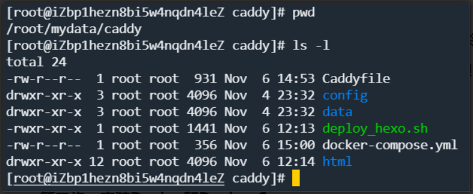
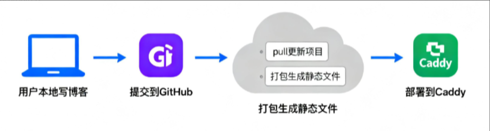

## 离职后的个人技术阵地：为什么选择阿里云托管Hexo博客
2025 年 10 月，当我结束上一份996的工作时，突然意识到需要一个完全属于自己的技术阵地。GitHub Pages虽然免费，但自定义域名必须绑定二级域名（[https://mrgbro.github.io/](https://mrgbro.github.io/)），而且国内访问速度不稳定；WordPress托管平台则受限于服务商的模板和功能。作为一名开发者，我需要**100%的控制权**——从域名解析到服务器配置，从SSL证书到缓存策略，每一个细节都要自己掌控。

这个需求直接指向了两个核心问题：**域名如何解析到自有服务器**？**用什么方案托管静态博客最省心**？经过调研，阿里云ECS成为最优解：学生机9.9元/月的入门价格，弹性扩展的配置选项，以及完整的备案服务（国内服务器必备），完美平衡了成本与自由度。

## 静态服务器三选一：为什么Caddy比Nginx和Apache更适合个人博客
确定使用阿里云ECS后，接下来要解决的是**用什么软件提供静态文件服务**。目前主流的选择有Nginx、Apache HTTPD和Caddy，我从配置复杂度、HTTPS支持、性能优化三个维度做了深度对比：

### 配置文件对比：从"写代码"到"说人话"
Nginx的配置需要理解server块、location指令等概念，即使是简单的静态服务也需要编写多行配置：

```nginx
server {
    listen 80;
    server_name homeey.top;
    location / {
        root /path/to/hexo/public;
        index index.html;
        expires 1d;  # 缓存配置
    }
}
```

Apache HTTPD则更复杂，需要修改httpd.conf主配置文件，再通过.htaccess文件补充设置，容易出现配置冲突。

而Caddy的配置堪称"革命性"——用自然语言描述需求即可：

```nginx
homeey.top {
    root * /path/to/hexo/public  # 指定网站根目录
    file_server                  # 启用静态文件服务 自动配置HTTPS
    tls your_email@example.com   # 自动配置HTTPS
}
```

这种"声明式"配置极大降低了上手门槛，对非专业运维人员友好度拉满。

### HTTPS支持：从手动申请到自动续期
Nginx需要手动从Let's Encrypt申请证书，配置ssl_certificate和ssl_certificate_key，每90天还要手动续期（或配置crontab脚本）。Apache的HTTPS配置步骤类似，同样繁琐。

Caddy则**内置ACME协议客户端**，会自动向Let's Encrypt申请证书并续期，只需在配置文件中指定邮箱（用于证书到期提醒），全程零手动操作。这一点对个人博客尤为重要——谁也不想因为忘记续期导致网站标红。

### 上手难度与生态：个人博客的"刚刚好"选择
Nginx性能强劲，但配置灵活意味着复杂度高，适合企业级应用；Apache生态丰富，但模块众多导致资源占用较高；Caddy专注于"开箱即用"，默认启用HTTP/2，支持自动GZIP压缩，对静态博客来说功能不多不少，恰到好处。

**结论**：Caddy以极简配置、自动HTTPS、低资源占用的优势，成为个人博客的理想选择。接下来我们将通过Docker部署Caddy，进一步简化安装和升级流程。

## 从零开始部署：阿里云ECS + Docker + Caddy实战指南
整个的目录规划如下：



### 第一步：购买并初始化阿里云ECS
1. **选择配置**：访问[阿里云ECS控制台](https://ecs.console.aliyun.com/)，新用户推荐"云服务器ECS-入门型"，2核2G内存配置足够支撑日均1000IP的博客访问。
2. **操作系统**：选择Ubuntu 22.04 LTS，对Docker支持友好，且命令行工具完善。
3. **安全组配置**：务必开放80（HTTP）、443（HTTPS）端口，否则网站无法访问。在ECS控制台"安全组"页面添加两条入站规则：
    - 端口范围：80/80，授权对象：0.0.0.0/0
    - 端口范围：443/443，授权对象：0.0.0.0/0

### 第二步：安装Docker和Docker Compose
安装请参照这篇文章的教程：[https://help.aliyun.com/zh/ecs/user-guide/install-and-use-docker](https://help.aliyun.com/zh/ecs/user-guide/install-and-use-docker)

### 第三步：编写Caddyfile配置文件
在服务器上创建/mydata/caddy目录(我是 root 账号)，用于存放博客文件和Caddy配置：

```bash
mkdir -p ~/mydata/caddy/{config,data,html}
cd ~/mydata/caddy
```

创建Caddyfile（注意替换为你的域名和邮箱）：

```plain
homeey.top {
    root * /var/www/html
    file_server

    # 启用缓存策略：HTML文件不缓存，静态资源缓存30天
    @static {
        file
        path *.js *.css *.png *.jpg *.jpeg *.gif *.ico *.svg *.woff *.woff2
    }
    header @static Cache-Control "public, max-age=2592000"  # 30天=2592000秒

    # 自动HTTPS配置
    tls jt4mrg@gmail.com  # 替换为你的邮箱，用于证书到期提醒

    # 启用Gzip压缩
    encode gzip
}

www.homeey.top {
    root * /var/www/html
    file_server

    # 启用缓存策略：HTML文件不缓存，静态资源缓存30天
    @static {
        file
        path *.js *.css *.png *.jpg *.jpeg *.gif *.ico *.svg *.woff *.woff2
    }
    header @static Cache-Control "public, max-age=2592000"  # 30天=2592000秒

    # 自动HTTPS配置
    tls jt4mrg@gmail.com  # 替换为你的邮箱，用于证书到期提醒      

    # 启用Gzip压缩
    encode gzip
}
```

### 第四步：通过Docker部署Caddy服务
创建docker-compose.yml文件，定义Caddy服务：

```yaml
version: "3.8"

services:
  caddy:
    image: caddy:latest
    container_name: caddy
    restart: unless-stopped
    ports:
      - "80:80"
      - "443:443"
    volumes:
      - /root/mydata/caddy/html:/var/www/html
      - /root/mydata/caddy/Caddyfile:/etc/caddy/Caddyfile
      - /root/mydata/caddy/data:/data
      - /root/mydata/caddy/config:/config
```

启动服务：

```bash
docker compose up -d
```

此时Caddy会自动完成：申请SSL证书 → 配置HTTPS → 启用Gzip压缩 → 设置缓存策略，整个过程无需人工干预。

### 第五步：生成并部署Hexo博客文件
我是在本机上写博客然后托管到 github 上这样可以有容灾备份。那我的整个部署流程是：



我利用 chatgpt 写了如下的部署脚本(deploy_hexo.sh)：

```shell
#!/bin/bash

# =============================
# Hexo 自动部署并刷新 Caddy
# =============================

# 源代码目录
SOURCE_DIR="/root/mydata/nginx/mrgbro.github.io"

# Hexo 生成的 public 目录
PUBLIC_DIR="$SOURCE_DIR/public"

# Caddy 静态站点目录
TARGET_DIR="/root/mydata/caddy/html"

# 进入 Hexo 项目目录
echo "进入 Hexo 项目目录：$SOURCE_DIR"
cd "$SOURCE_DIR" || { echo "目录不存在: $SOURCE_DIR"; exit 1; }

#先做一下依赖更新防止添加了新依赖
npm install || { echo "npm install 失败"; exit 1; }

#先做本地清理
npx hexo clean || { echo "清理失败"; exit 1; }


# 暂存本地修改，防止 git pull 冲突
echo "检测本地修改并暂存（git stash）..."
git stash || { echo "git stash 失败"; exit 1; }

# 拉取最新代码
echo "执行 git pull 更新代码..."
git pull || { echo "git pull 失败"; exit 1; }

# 清理旧生成文件 & 生成新站点
echo "执行 Hexo clean && Hexo generate..."
npx hexo clean && npx hexo generate || { echo "Hexo 构建失败"; exit 1; }

# 确保目标目录存在
mkdir -p "$TARGET_DIR"

# 清空旧文件
echo "清空旧站点文件：$TARGET_DIR"
rm -rf "$TARGET_DIR"/*

# 移动新生成文件
echo "复制新生成文件到 Caddy 目录..."
cp -r "$PUBLIC_DIR"/* "$TARGET_DIR"/ || { echo "复制文件失败"; exit 1; }

# 重启 Caddy
echo "重启 Caddy..."
docker compose -f /root/mydata/caddy/docker-compose.yml restart caddy || { echo "Caddy 重启失败"; exit 1; }

echo "✅ Hexo 部署完成并刷新 Caddy 成功"
```

> 注意：这里需要你的服务器具备 node 环境，版本和你本机上的 node 版本保持一致，防止出现版本不一致带来的兼容性问题
>

### 第六步：配置域名解析
登录阿里云域名控制台，添加两条解析记录：

1. **A记录**：主机记录@，记录值你的服务器公网IP，TTL 10分钟
2. **A记录**：主机记录www，记录值你的服务器公网IP，TTL 10分钟

等待解析生效（通常10-30分钟）后，就能通过域名访问博客了。

## 从想法到上线：个人博客托管的最佳实践总结
回顾整个过程，从离职后萌生建站想法，到最终通过阿里云ECS + Docker + Caddy部署完成，总共花费了**3天时间**和**不到50元成本**（含域名和服务器）。这个方案的核心优势在于：

+ **完全控制权**：从域名到服务器，每一个环节都自主掌控
+ **极简维护**：Caddy自动处理HTTPS和证书续期，Docker简化版本升级
+ **性能优化**：缓存策略 + CDN加速，实现毫秒级页面加载
+ **低成本启动**：学生机9.9元/月，随着访问量增长可弹性升级配置

如果你也想拥有一个完全属于自己的技术博客，这个方案值得尝试。记住，最好的学习方式就是动手实践——现在就打开阿里云控制台，开始搭建你的个人技术阵地吧！