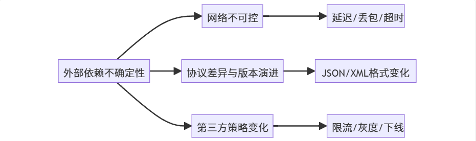
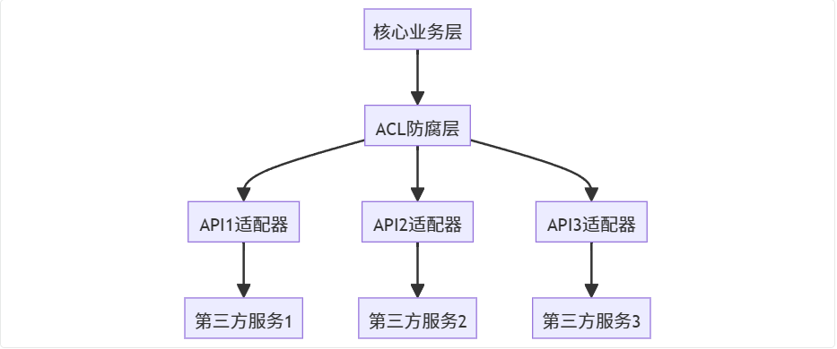
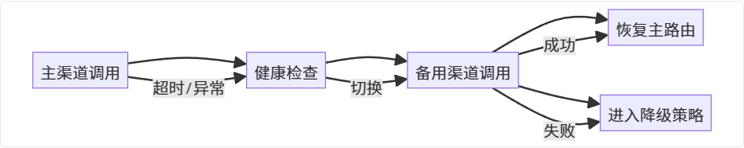
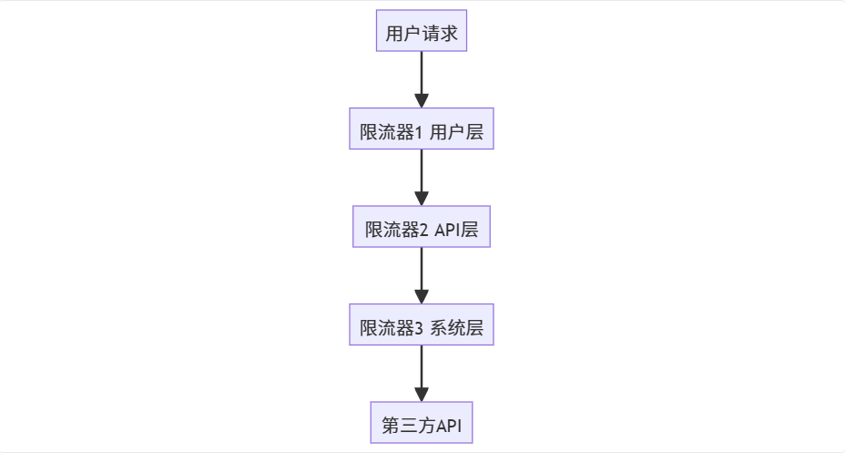
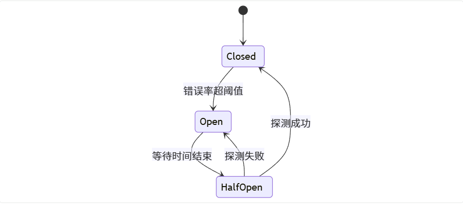
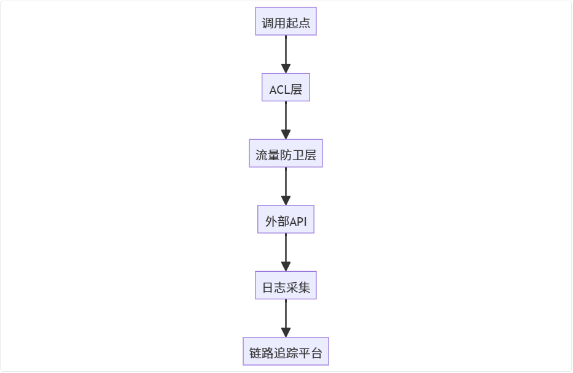
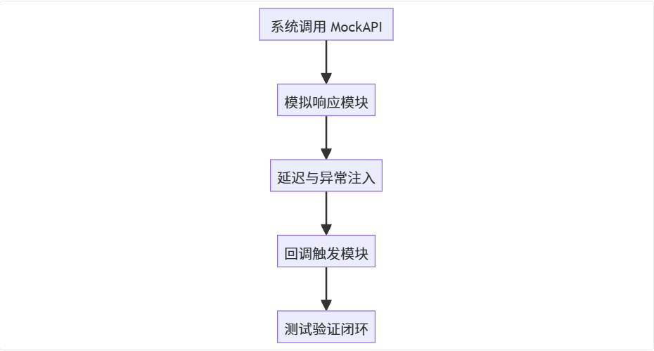
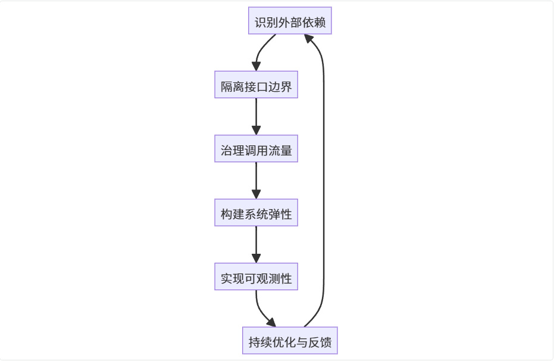

在分布式架构时代，没有任何系统是孤立存在的。我们的系统与数十个外部 API 相互依赖，但它们的稳定性、时延、协议差异，都可能成为潜在的“定时炸弹”。那么——如何构建一套 **面向异构 API 的高可用架构范式**，让外部依赖也能稳如泰山？

---

## 一、引言：异构 API 集成的挑战
当系统进入多服务协作时代，“高可用”不再只是指内部稳定性，而是**如何在外部依赖不稳定的情况下依旧保持核心功能可用**。

以一个常见的例子来说：

+ A 系统需要调用 B 平台提供的身份认证、消息通知或计费接口；
+ B 的 SLA 不在我们的掌控之中；
+ 但一旦它“抖”一下，锅往往是我们来背。

这正是异构 API 集成的本质挑战：

**我们无法控制外部系统，但必须为其不确定性负责。**

---

## 二、异构 API 的三大不确定性
无论是支付网关、地图服务、OCR、还是数据同步接口，异构 API 通常有三大不确定性：



1. **网络不可控** ：延迟、丢包、DNS 抖动、跨境传输等问题时常发生。
2. **协议差异与演进** ：不同 API 使用不同签名算法、认证方式，甚至版本字段变动。
3. **策略变化频繁** ：限流策略调整、权限收紧、接口下线，都可能引发连锁故障。

**架构师的职责，不是让第三方完美可控，而是让我们的系统在“不完美中依然稳定”。**

---

## 三、通用集成范式的设计思路
从架构视角看，设计异构 API 的高可用体系，目标可拆解为：

+ **隔离外部波动**
+ **控制系统压力**
+ **增强调用弹性**
+ **保障核心可用**
+ **支撑持续观测与改进**

接下来，我们通过八个关键设计策略，构建出可落地的通用范式。

---

## 第一招：ACL 防腐层 —— 隔离技术异构性
外部系统协议、数据格式各不相同，如果直接在核心业务中集成调用，系统很快会陷入“接口地狱”。

**解决方案：引入 ACL（Anti-Corruption Layer）防腐层。**



ACL 防腐层承担三类职责：

1. **协议转换** ：屏蔽外部 HTTP、RPC、私有协议的差异；
2. **数据标准化** ：统一 JSON、XML、FormData 等格式；
3. **安全签名与回调处理** ：在边界层完成加解密、验签和回调统一。

**好处**：

+ 内部系统始终与统一的标准接口交互；
+ 未来替换外部 API，只需调整防腐层实现，不影响上层业务。

---

## 第二招：策略模式 —— 实现动态主备与故障切换
当多个 API 提供同类能力（例如两个不同供应商的接口），可以通过**策略模式 + 动态路由**实现自动切换。

```java
public interface ApiProvider {
    ApiResponse invoke(Request req);
}

public class ProviderA implements ApiProvider {
    public ApiResponse invoke(Request req) { /* 调用A接口 */ }
}

public class ProviderB implements ApiProvider {
    public ApiResponse invoke(Request req) { /* 调用B接口 */ }
}

public class ApiRouter {
    private List<ApiProvider> providers;

    public ApiResponse route(Request req) {
        for (ApiProvider p : providers) {
            try { return p.invoke(req); }
            catch (Exception e) { markUnhealthy(p); }
        }
        throw new RuntimeException("All providers failed.");
    }
}
```

策略模式的关键是：

+ **健康检查** ：定期检测接口延迟与错误率；
+ **动态路由** ：基于健康状态自动切换主备；
+ **降级机制** ：所有渠道不可用时，进入应急模式（缓存、异步处理等）。



---

## 第三招：流量防卫层 —— 精准限流与过载保护
第三方 API 常有调用频控（如 QPS 10/s），超量请求不仅被拒绝，还浪费资源。

**解决方案：在客户端侧提前限流。**

可以使用如 `Guava RateLimiter` 或 `Sentinel`：

```java
RateLimiter limiter = RateLimiter.create(10.0); // 每秒10次
if (limiter.tryAcquire()) {
    callExternalApi();
} else {
    throw new TooManyRequestsException();
}
```

四个核心限流策略：

1. **多级限流** ：按接口/功能分级，保障核心调用优先。
2. **动态调整** ：根据实时监控自适应调整阈值。
3. **请求分级处理** ：关键请求可排队重试，非核心直接失败。
4. **多层防护** ：在用户层、API层、系统层均设限流点。



---

## 第四招：容错机制 —— 超时控制与智能重试
偶发的网络抖动或超时是常态，合理的重试可以显著提高可用性。

使用**指数退避重试策略（Exponential Backoff）** ：

```plain
Retryer<Boolean> retryer = RetryerBuilder.<Boolean>newBuilder()
    .retryIfException()
    .withWaitStrategy(WaitStrategies.exponentialWait(1, 60, TimeUnit.SECONDS))
    .withStopStrategy(StopStrategies.stopAfterAttempt(5))
    .build();

retryer.call(() -> callExternalApi());
```

**要点：**

+ 确保 API 幂等；
+ 重试间隔逐步增加，避免雪崩；
+ 日志中记录唯一请求 ID 以追踪。

---

## 第五招：熔断与降级 —— 防止系统级雪崩
当第三方持续故障时，应立即“切断电路”，防止拖垮自身。

使用 **Resilience4j** 或 Hystrix：

```java
CircuitBreakerConfig config = CircuitBreakerConfig.custom()
    .failureRateThreshold(50)
    .slowCallRateThreshold(80)
    .slowCallDurationThreshold(Duration.ofSeconds(3))
    .waitDurationInOpenState(Duration.ofSeconds(30))
    .build();

CircuitBreaker breaker = CircuitBreaker.of("extApi", config);

CheckedFunction0<String> decorated = CircuitBreaker
    .decorateCheckedSupplier(breaker, () -> callExternalApi());

String result = Try.of(decorated)
    .recover(e -> "fallback result")
    .get();
```

熔断三状态模型：



---

## 第六招：全链路可观测性 —— 让故障有迹可循
可观测性不是锦上添花，而是故障边界的生命线。

建立三大支柱：

+ **Metrics（指标）** ：延迟、错误率、限流次数、熔断状态；
+ **Logs（日志）** ：调用上下文、异常堆栈；
+ **Traces（链路）** ：跨系统 TraceID 跟踪。



搭配 Prometheus + SkyWalking，可实现从指标到调用路径的全链路追踪。  
通过告警分级（P0电话、P1消息、P2邮件）避免报警风暴。

---

## 第七招：异步降级 —— 用解耦保护核心
对于实时性要求不高的场景（如数据上报、统计、同步），可以采用**同步转异步**机制，将外部调用移出主链路。

```java
public class AsyncHandler {
    private final BlockingQueue<Request> queue = new LinkedBlockingQueue<>();

    public void handle(Request req) {
        if (isApiHealthy()) callExternalApi(req);
        else queue.offer(req);
    }

    @Scheduled(fixedRate = 5000)
    public void processQueue() {
        Request req;
        while ((req = queue.poll()) != null) callExternalApi(req);
    }
}
```

这种模式的核心思想是：

**快速响应主流程，延迟处理非关键任务。**

---

## 第八招：Mock 服务 —— 构建稳定的测试与验证体系
第三方测试环境常不稳定、调用成本高。  
通过自建 Mock 服务，可以在研发阶段验证集成逻辑与容错能力。

Mock 服务需支持：

1. 模拟正常与异常响应；
2. 模拟回调逻辑；
3. 支持性能压测（可调耗时、错误率）。



---

## 通用高可用设计方法论总结
通过以上八大策略，我们可以提炼出一套通用的异构 API 集成方法论：

### 一、六步闭环设计模型
| 阶段 | 核心目标 | 关键手段 |
| --- | --- | --- |
| 1️⃣ 识别依赖 | 找出所有外部接口 | 列出调用链与关键路径 |
| 2️⃣ 隔离边界 | 降低耦合风险 | ACL、防腐层 |
| 3️⃣ 流量治理 | 控制系统压力 | 限流、速率调整 |
| 4️⃣ 构建弹性 | 容错、重试、熔断 | 提升自愈力 |
| 5️⃣ 可观测性 | 快速定位问题 | 指标+日志+链路 |
| 6️⃣ 持续优化 | 数据驱动改进 | 压测、Mock、自动切换 |


### 二、架构思维模型（Mermaid）


这形成了一个“自愈循环”： 发现 → 隔离 → 防护 → 观测 → 优化 → 再发现。

从工程实践角度，这一模型不仅适用于第三方 API 集成，也同样适用于微服务间调用、平台 SDK 封装以及多云服务接入等复杂场景。

---

## 结语
在真实的生产环境中，外部依赖的不确定性永远存在。一个优秀的架构师，不是消除不确定性，而是**设计出可承受不确定性的系统**。“让外部的不确定，变成系统的确定。” —— 这，正是面向异构 API 的通用集成范式的核心精神。


