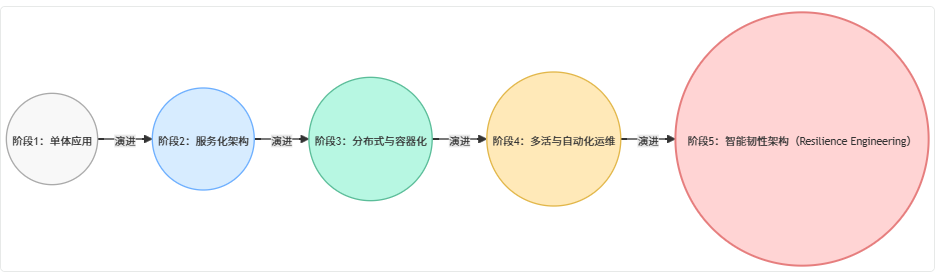

## 摘要
高可用系统的设计，是架构体系中最具挑战性的部分。本文从多年实践经验出发，系统化总结高可用架构的核心理念与设计策略，提出以“**HA-5E 模型**”为核心的可复用方法论框架，涵盖从研发规范、应用层、存储层、运维层到应急体系的全链路设计思维。

---

## 一、引言：从“稳定运行”到“高可用体系化设计”
高可用（High Availability, HA）是衡量系统健壮性的重要指标。  
但真正的高可用，并不仅仅是“系统不宕机”，而是当**部分组件故障时，整体仍能持续提供服务**。它要求我们从“避免出错”的被动思维，转向“容错与自愈”的主动设计。

在现代互联网架构中，高可用是一个**跨层级的系统工程**，涉及研发、产品、存储、运维、安全等多个维度。  
这就需要一套方法论，指导我们在复杂的业务与技术环境下，**持续构建具备韧性的系统**。

---

## 二、可用性与高可用指标体系
**可用性（Availability）** 是系统在可操作状态下的时间比例，常用“几个9”来衡量：

| 可用性     | 年停机时间 | 业务类型       |
|---------|-------|------------|
| 99%     | 3.65天 | 内部系统、非核心业务 |
| 99.9%   | 8.7小时 | 普通互联网应用    |
| 99.99%  | 52分钟  | 电商、支付系统    |
| 99.999% | 5分钟   | 金融级交易系统    |

提升一个“9”往往意味着**指数级的成本增长**，因此架构设计的关键在于：  
“**以最小代价实现足够的可用性目标**”。

---

## 三、高可用架构设计原则
### 3.1 Design for Failure —— 面向故障而设计
假设所有依赖都会失败。  
系统必须具备：

+ 故障检测；
+ 自动隔离；
+ 快速恢复；
+ 降级运行的能力。

### 3.2 分层与解耦
分层使系统具备可控性，解耦使模块具备独立性。  
通过消息队列、缓存层、异步任务等手段，防止故障扩散。

### 3.3 自动化与弹性
弹性扩缩容与自动修复机制，确保系统在负载波动时仍稳定运行。

### 3.4 冗余与容灾
任何单点都可能成为风险点。通过多副本、多机房部署确保高可用。

### 3.5 可观测与演练
可观测性（Observability）让系统具备“自我感知”能力；  
混沌工程（Chaos Engineering）让系统在“模拟灾难”中锻炼韧性。

---

## 四、高可用体系的分层设计实践

高可用的系统架构，不是一层技术堆叠，而是**六层协同体系**：

---

### 4.1 研发规范层：高可用的起点
**研发流程即稳定性边界。**

+ **方案设计规范化**：统一模板、强制评审、文档化决策；
+ **编码规范化**：集中日志、分布式追踪、代码检查；
+ **单测与覆盖率**：以最小代价提前暴露潜在问题；
+ **容量规划与性能压测**：通过 QPS 漏斗模型预估峰值容量。

---

### 4.2 应用服务层：核心高可用实践区
1. **无状态化与负载均衡**  
   多实例部署 + 动态流量分配（Nginx、LVS、Eureka、Consul）。
2. **弹性扩缩容**  
   基于 K8s HPA 自动伸缩或自研扩缩容引擎。
3. **异步解耦与削峰填谷**  
   通过消息队列（Kafka、RocketMQ）隔离模块、消化突发流量。
4. **容错机制（Fail Fast）**  
   快速失败而非阻塞等待，避免雪崩效应。
5. **过载保护**
    - 限流：保护边界容量；
    - 熔断：隔离下游故障；
    - 降级：保留核心功能、舍弃非关键特性。

---

### 4.3 存储层：有状态系统的高可用核心
#### 常见策略对比：
| 模式    | 特点        | 适用场景                   |
|-------|-----------|------------------------|
| 主备复制  | 写主读备      | 后台系统                   |
| 主从复制  | 主写从读      | 中型互联网服务                |
| 主从切换  | 自动容灾      | 生产环境主流                 |
| 主主复制  | 双主互备      | 高一致性要求系统               |
| 分布式存储 | 多节点、分片、冗余 | 大规模数据系统（HDFS、ES、HBase） |

数据层的核心目标：**不丢、不乱、可恢复**。

---

### 4.4 产品层：柔性降级与用户兜底
技术的高可用，最终要转化为用户感知的平滑体验。

常见兜底策略：

+ 异常时展示缓存数据或默认页面；
+ 停机维护页替代 5xx 报错；
+ 对关键商品、活动提供“兜底模板”；
+ 异常提示文案替代空白屏。

---

### 4.5 运维与部署层：高可用的执行底座
1. **灰度发布**：分阶段放量验证新版本稳定性；
2. **接口拨测**：5秒级健康检测，自动触发告警；
3. **监控与可观测体系**：
    - ELK（日志分析）、Prometheus（指标监控）、OpenTelemetry（全链路追踪）；
4. **多机房容灾部署**：
    - 服务层多活，存储层异步复制；
5. **混沌实验（Chaos Engineering）**：  
   模拟机房断网、节点宕机，检验自愈与降级策略。

---

### 4.6 异常应急层：从事故到自愈的闭环
应急预案的核心是 **“标准化恢复路径”**。

+ 建立系统级 SOP（Standard Operation Procedure）；
+ 模拟各类异常场景（网络隔离、超时、磁盘满）；
+ 保证“快速定位 → 快速隔离 → 快速恢复 → 事后复盘”闭环；
+ 定期应急演练，保持团队响应熟练度。

---

## 五、典型案例：电商系统的高可用架构设计
以典型电商业务为例，一个高可用系统从入口到数据层的容错链路如下：

**核心防护链：**

+ 请求层：负载均衡 + 灰度流控；
+ 服务层：无状态 + 限流熔断 + 异步队列；
+ 数据层：多副本 + 自动切换；
+ 运维层：多机房 + 可观测体系 + 演练。

---

## 六、高可用架构设计方法论总结（HA-5E 模型）
| 维度 | 含义 | 关键实践 |
| --- | --- | --- |
| **Elasticity** | 弹性扩缩容 | 自动伸缩、资源动态分配 |
| **Redundancy** | 冗余设计 | 多实例、多机房、多副本 |
| **Isolation** | 隔离设计 | 服务解耦、限流熔断、降级保护 |
| **Observability** | 可观测性 | 日志、指标、链路追踪、告警体系 |
| **Recoverability** | 可恢复性 | 自愈机制、混沌演练、应急预案 |

这五个维度共同构成了高可用架构的“韧性五边形”，是从工程到运营的统一思维框架。

---

## 七、高可用架构演进路线图

**演进说明：**

+ **阶段1：单体应用**
    - 部署集中，单点风险高。
+ **阶段2：服务化架构**
    - 基于 RPC 或微服务，具备基本可扩展性。
+ **阶段3：分布式 + 容器化**
    - 支持弹性伸缩与自动调度。
+ **阶段4：多活与自动化运维**
    - 实现跨机房部署、自动化监控与故障切换。
+ **阶段5：智能韧性架构**
    - 通过自愈算法、混沌演练、智能决策实现系统自我优化。

## 八、结语：从可靠到韧性
高可用的终极目标，并非永不失败，而是“**在失败中保持秩序**”。  
真正的高可用体系，是一种 **工程能力 + 组织文化** 的结合：

+ 架构设计上：防故障、抗突发、可恢复；
+ 工程实现上：可观测、可演练、可优化；
+ 团队协同上：流程标准化、响应体系化。

高可用不是终点，而是一场持续演进的修炼。每一个“故障”都是一次架构成长的契机。

**推荐实践：**

+ 定期执行混沌实验，检验容错机制；
+ 建立全链路压测体系；
+ 每季度审视一次“高可用架构五要素”的执行情况。

